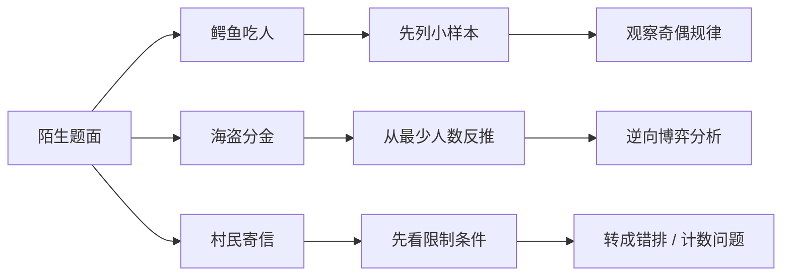
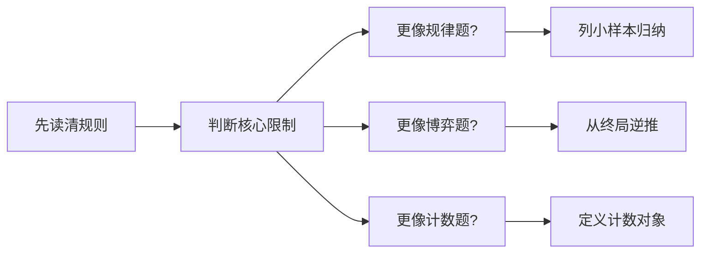

# 例题-鳄鱼吃人-海盗分金-村民寄信

[返回章节](README.md) | [返回分类](../README.md) | [返回总目录](../../README.md)

- 状态：已标记完成
- 所属分类：基础巩固
- 所属章节：12 暴力递归到动态规划1-递归尝试
- 原始条目：☒ 课前小练

## 一句话结论
这页不是在讲某一个固定递归模板，而是在训练“看到陌生题面后，先判断问题结构”的能力。  
鳄鱼吃人更像找规律，海盗分金更像逆向博弈，村民寄信更像计数 / 错排问题；重点不是立刻写代码，而是先把题型认出来。

## 理论 / 应用价值

### 在知识体系中的位置

```text
暴力递归与动态规划之前
  -> 先学会识别题目结构
课前小练
  -> 不急着套递归模板
业务规则抽象
  -> 判断更像归纳 / 博弈 / 计数
后续正式建模
  -> 再决定递归、DP、数学推导怎么上
```

### 为什么值得学

1. **它训练的是“先分类，再求解”**
   - 很多题一上来并不是代码问题
   - 而是“这题到底属于哪一类”

2. **它能避免误套模板**
   - 不是所有题都该先写递归
   - 有些题更适合先归纳规律，有些题更适合逆推

3. **它在面试里非常常见**
   - 面试官经常先给你一道陌生题
   - 真正考的不是你有没有见过原题，而是能不能快速抽象问题结构

### 它解决的核心问题

- 面对陌生题面，如何先读出真正的限制条件
- 如何分辨题目更像规律题、博弈题，还是计数题
- 如何从“故事描述”切换成“可分析的数学 / 算法模型”

### 与相邻题型的关系

- 和前面的数字转字母、背包、纸牌博弈不同，这页不是单一模板题
- 它更像正式进入模型化做题之前的一次“分析热身”
- 这类训练和后面的尝试模型、动态规划并不冲突，而是在补“起手能力”

## 核心知识点
- 先抽规则，再选方法
- 陌生题常见三类入口：
  - 找规律 / 归纳
  - 逆向推理 / 博弈
  - 组合计数 / 容斥 / 错排
- 题面像故事，不代表不能数学化
- 先识别结构，比先算答案更重要

## 图片转写 / 题意还原
原始笔记列了三道热身题：

1. **鳄鱼吃人问题**
   - 原笔记结论提示是：奇数只鳄鱼可以过，偶数只不能过
   - 这说明它更像一类先列小样本、再归纳规律的问题

2. **海盗分金问题**
   - 这是经典逆向推理博弈题
   - 重点通常不是暴力枚举，而是从人数最少时反推回来

3. **村民寄信问题**
   - 这是经典“错排”味道的计数题
   - 核心是数一数“每个人都没有收到自己的信”共有多少种安排

把这页整理成更完整的说明，可以理解为：

- 给出三道看起来不像标准算法模板的题
- 目的不是立刻写出代码
- 而是训练这样一套起手动作：

```text
先把故事规则翻译成约束
再判断它更像哪类模型
最后再决定该用规律、逆推、递归还是计数公式
```

如果按“输入 / 输出”来理解，这页更像一组分析训练题：

- **输入**：三道不同类型的题面规则
- **输出**：对每道题选择合适的分析路径，而不是先机械写代码

## 图解

### 三道小练对应的分析入口



**读图抓手**：
- 三道题的共同点不是“解法一样”，而是都要求先抽结构。
- 真正的第一步不是写递归，而是判断该往哪种分析路径走。
- 这页的价值就在于训练“选方向”的能力。

### 看到陌生题时的推荐顺序



**关键观察**：
- 题目长得花，不代表分析顺序要乱。
- 先判断模型，再下手计算，会比盲试快得多。

## 解题思路

### 为什么这么做
这三道题放在一起，不是因为它们答案相似，而是因为它们有同一个训练目标：

- 不要看到题就先套模板
- 要先把题目到底在考什么想明白

很多人卡住，不是不会写代码，而是第一步就判断错了题型。

### 怎么做：分别看三道题

#### 1. 鳄鱼吃人问题：优先想“找规律 / 归纳”

这类题的信号通常是：

- 题面带有明显递推味道
- 小规模情况容易手推
- 题目想让你发现某个奇偶性、周期性或不变量

原笔记直接给出的规律提示是：

```text
奇数只鳄鱼可以过
偶数只鳄鱼不能过
```

所以这题的重点不是暴力模拟，而是：

- 先列 `1,2,3,4,5...` 的小样本结果
- 再去总结稳定规律

#### 2. 海盗分金问题：优先想“逆向推理 / 博弈”

这类题的信号通常是：

- 有多个理性参与者
- 每个人都会为了自己利益做最优选择
- 当前策略要考虑后续人的反应

它的经典思路是：

- 从人数最少的情形开始分析
- 一步步往前反推
- 当前人要做的是“给出一个刚好能让方案通过的分配”

也就是说，这题不适合从前往后硬想，更适合从终局往前倒推。

#### 3. 村民寄信问题：优先想“计数 / 错排”

这类题的信号通常是：

- 题目问“共有多少种安排”
- 每个对象都要满足某种限制
- 典型限制是“不能放回自己的位置”

这正是经典错排问题的味道：

```text
n 个人寄信
每个人都不能收到自己的信
问一共有多少种寄法
```

常见分析路径是：

- 先定义“合法安排”是什么
- 再按某个人的去向分类
- 最后写成递推式或容斥表达式

### 为什么对
因为这页的目标本来就不是求某一道题的唯一代码解，而是训练一件更底层的事：

- 先识别问题结构
- 再匹配分析工具

三道题分别把三种高频入口摆在一起：

- 规律归纳
- 博弈逆推
- 计数建模

所以只要你能先把这三条主线区分开，这页训练目标就达到了。

## 复杂度
这页更偏“题型辨认”和“分析入口总结”，不是单一算法实现题，所以没有统一的时间复杂度和空间复杂度。

- **鳄鱼吃人**：更关注样本归纳和规律总结
- **海盗分金**：更关注逆推链条
- **村民寄信**：更关注计数模型或递推式

## 典型例子

### 例子 1：鳄鱼吃人先列小样本

如果题目提示最后结论和奇偶有关，那么正确起手往往不是直接证明，而是先列：

```text
1 只时怎样
2 只时怎样
3 只时怎样
4 只时怎样
```

当你发现结果开始稳定成“奇数可、偶数不可”时，再去想为什么这个规律能持续。

### 例子 2：海盗分金先看最小规模

逆推题最怕一开始就站在“大样本”上胡思乱想。  
更稳妥的顺序通常是：

```text
1 个海盗时怎么分
2 个海盗时怎么分
3 个海盗时怎么分
...
```

一旦最小规模想清楚，前面的决策就会有依赖依据。

### 例子 3：村民寄信先定义“合法”

如果有 3 个村民 A、B、C，合法寄法不是“任意排列”，而是：

```text
A 不能寄给 A
B 不能寄给 B
C 不能寄给 C
```

这样题目才真正被翻译成了一个可计数的问题。

## 易错点
- 不要把三道题强行套成同一种算法题
- 不要看到“面试题”就默认一定先写递归
- 鳄鱼题更重要的是找规律，不是盲目暴搜
- 海盗题的关键是逆推，不是顺推
- 村民寄信题的关键是先定义清楚“合法安排”，再谈计数

## 代码 / 伪代码
这页不是单一代码题，更适合记一份“分析流程伪代码”：

```text
面对陌生题面:
1. 先把题目规则翻成明确约束
2. 判断它更像:
   - 规律归纳
   - 逆向博弈
   - 组合计数
3. 选对应方法:
   - 规律题 -> 列小样本
   - 博弈题 -> 从终局往前推
   - 计数题 -> 定义合法对象并分类讨论
4. 最后再决定是否需要递归、DP 或公式化表达
```

## 记忆点
- 先认题型，再动手算。
- 题面像故事，不代表不能抽成数学结构。
- 鳄鱼看规律，海盗看逆推，寄信看计数。
- 这页训练的不是代码速度，而是建模方向感。
