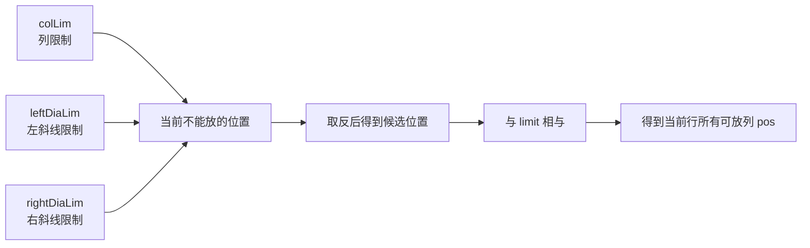
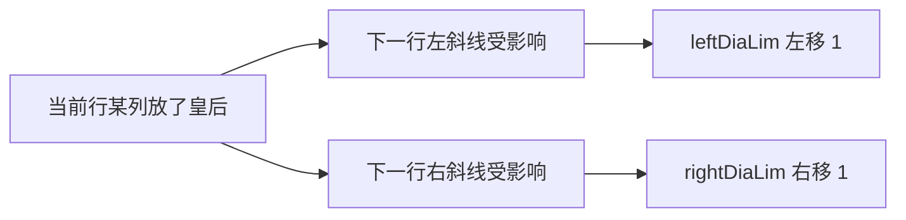

# N皇后问题-改进方法2-使用位运算-复杂度为N的N次方

[返回章节](README.md) | [返回分类](../README.md) | [返回总目录](../../README.md)

- 状态：已标记完成
- 所属分类：基础巩固
- 所属章节：12 暴力递归到动态规划1-递归尝试
- 原始条目：☒ N皇后问题（改进方法2，使用位运算，复杂度为N的N次方）

## 一句话结论
`N` 皇后是典型的回溯搜索题：按行放皇后，每一行只决定“这一行放哪一列”。  
位运算优化的核心，不是改变题目本质，而是把“列限制、左斜线限制、右斜线限制”压成三个整数位图，让“当前有哪些位置能放”这件事可以一次位运算算出来。

## 理论 / 应用价值

### 在知识体系中的位置

```text
基础回溯
  -> 学会按层做决策
排列 / 剪枝题
  -> 体会搜索树怎么缩小
N 皇后
  -> 高质量搜索与剪枝样板
位运算优化
  -> 把状态压成位图，加速分支枚举
```

### 为什么值得学

1. **它是回溯 + 剪枝的经典模板题**
   - 每一层代表一行
   - 每个分支代表这一行选择哪一列

2. **它能训练“状态压缩”的思维**
   - 普通写法需要逐列判断冲突
   - 位运算写法直接把冲突信息压进二进制位

3. **它是位运算在搜索题中的代表应用**
   - `pos & -pos` 取最右侧 `1`
   - `<< 1` / `>> 1` 表示斜线限制随下一行移动

### 它解决的核心问题

- 如何高效统计 `N` 皇后的合法摆法数量
- 如何把“不能同列、不能同斜线”转成机器更擅长处理的位集合运算
- 如何在不改变搜索逻辑的前提下，把实现速度显著提高

### 与相邻题型的关系

- 和全排列、去重排列一样，都是典型搜索树问题
- 和前面的“从左往右模型”不同，它更像“按层展开的多叉回溯”
- 和后续的动态规划题不同，`N` 皇后通常不是拿来改经典 DP 的，而是用来训练剪枝和位运算优化

## 核心知识点
- 每一行必须恰好放一个皇后
- 决策顺序：按行递归
- 冲突来源：
  - 同列
  - 左斜线
  - 右斜线
- 三个位图含义：
  - `colLim`：已经被占用的列
  - `leftDiaLim`：下一行不能放的左斜线位置
  - `rightDiaLim`：下一行不能放的右斜线位置
- `pos = limit & (~(colLim | leftDiaLim | rightDiaLim))`
- `mostRightOne = pos & (-pos)` 用来依次枚举一个可放位置

## 图片转写 / 题意还原
这题的标准描述是：

- 在一个 `N x N` 的棋盘上放置 `N` 个皇后
- 要求任意两个皇后都不能：
  - 在同一行
  - 在同一列
  - 在同一条对角线上
- 给定整数 `n`
- 返回一共有多少种不同的合法摆法

**输入**：
- 一个整数 `n`

**输出**：
- 一个整数，表示合法摆法数量

**边界 / 示例**：
- `n = 1`，返回 `1`
- `n = 2`，返回 `0`
- `n = 3`，返回 `0`
- `n = 8`，返回 `92`

这题本质上不是“求一种摆法”，而是：

```text
按行展开搜索树
统计所有合法分支的数量
```

## 图解

### 普通回溯的决策树长什么样


**读图抓手**：
- 每一层只处理一行。
- 当前层只关心“这一行放哪一列”。
- 如果某一列和前面皇后冲突，这个分支直接剪掉。

### 位运算版的三个限制位图



**关键观察**：
- 三个位图都只是在描述“当前行哪些列不能放”。
- 先把三种限制按位或起来，再取反，就能得到“哪些位置还可以放”。
- 最后和 `limit` 相与，是为了把高位无关位清掉，只保留棋盘范围内的列。

### 为什么斜线限制要移位



**读图抓手**：
- 皇后如果在当前行第 `col` 列，那么下一行会多出两个被攻击位置。
- 左下方向在下一行看起来要偏左还是偏右，取决于位图定义方式；这套代码约定是：
  - 左斜线限制用 `<< 1`
  - 右斜线限制用 `>> 1`
- 记公式时不用死抠“几何左还是位图左”，直接跟着代码约定记即可。

## 解题思路

### 为什么这么做
普通回溯的逻辑其实已经很自然：

- 第 `row` 行尝试每一列
- 判断能不能放
- 能放就递归下一行

问题在于，普通写法每次都要去和前面所有皇后比较冲突，判断成本较高。  
位运算版并没有改变搜索树，只是把“判断哪些列能放”从逐个比较，变成了一次位计算。

### 怎么做：先理解 `limit`

`limit` 表示棋盘总共有哪几列可用。

如果 `n = 7`，那么：

```text
limit = 0b1111111
```

如果 `n = 4`，那么：

```text
limit = 0b1111
```

也就是说，最低的 `n` 个二进制位对应棋盘的 `n` 列。

### 三个位图分别表示什么

#### 1. `colLim`
哪些列已经放过皇后，当前行不能再放。

#### 2. `leftDiaLim`
受前面皇后的左斜线攻击，当前行不能放的位置集合。

#### 3. `rightDiaLim`
受前面皇后的右斜线攻击，当前行不能放的位置集合。

把三者合起来：

```text
colLim | leftDiaLim | rightDiaLim
```

就能知道当前行所有“被封锁”的列。

### 当前行可放位置怎么算

```text
pos = limit & (~(colLim | leftDiaLim | rightDiaLim))
```

含义是：

1. 先把所有不能放的位置合并起来
2. 取反，得到“理论上能放”的位置
3. 再和 `limit` 相与，去掉棋盘范围外的位

算出来的 `pos` 中，每一个值为 `1` 的位，都代表当前行一个合法落点。

### 如何枚举 `pos` 里的每个合法位置

每次取最右侧的 `1`：

```text
mostRightOne = pos & (-pos)
```

然后：

- 用这个位置做一次递归分支
- 再把它从 `pos` 里删掉

```text
pos -= mostRightOne
```

这样一轮 `while (pos != 0)`，就把当前行所有合法列都枚举完了。

### 递归怎么更新状态

如果当前行选择了 `mostRightOne`：

- 新的列限制：

```text
colLim | mostRightOne
```

- 新的左斜线限制：

```text
(leftDiaLim | mostRightOne) << 1
```

- 新的右斜线限制：

```text
(rightDiaLim | mostRightOne) >> 1
```

然后递归处理下一行。

### base case

当：

```text
colLim == limit
```

说明 `n` 列里对应的 `n` 个皇后都已经放完了，也就是找到了一种完整合法摆法，返回 `1`。

### 关于标题里的“复杂度为 N 的 N 次方”
原始条目沿用了课程里的口径，但更严谨地说：

- 位运算版**确实比普通回溯快很多**
- 但 `N` 皇后的精确复杂度并不适合简单写成一个严格的 `N^N` 结论
- 实际上它仍然是搜索问题，只是借助位运算把常数和剪枝效率优化得非常明显

所以这篇更值得记住的是：

```text
位运算优化的是“搜索效率”
不是把问题变成了一个简单多项式算法
```

## 复杂度
- **时间复杂度**：很难用一个特别紧的简单式子精确描述
  - 仍然属于高复杂度搜索
  - 但位运算版相比普通逐列检查版会快很多
- **空间复杂度**：`O(N)`
  - 主要来自递归深度

## 典型例子

以 `n = 4` 为例：

### 先确定 `limit`

```text
limit = 1111
```

表示 4 列都在棋盘内。

### 初始状态

```text
colLim      = 0000
leftDiaLim  = 0000
rightDiaLim = 0000
```

于是：

```text
pos = 1111 & ~(0000 | 0000 | 0000)
    = 1111
```

说明第一行 4 列都能放。

### 取第一条分支

先取最右侧的 `1`：

```text
mostRightOne = 0001
```

表示第一行把皇后放在最右边那一列。

更新后进入下一行：

```text
colLim      = 0001
leftDiaLim  = 0010
rightDiaLim = 0000
```

这时第二行可放位置：

```text
pos = 1111 & ~(0001 | 0010 | 0000)
    = 1111 & ~0011
    = 1100
```

说明第二行只剩两列可选。

### 继续递归

之后同样重复：

- 取 `pos` 中最右侧的 `1`
- 更新三个位图
- 递归下一行

最终把所有合法分支走完，就能统计出 `n = 4` 时的答案为：

```text
2
```

## 易错点
- `limit` 不是“当前限制”，而是“棋盘有效列范围”
- `pos` 表示的是“当前行还能放的位置”，不是“已经放了的位置”
- `mostRightOne = pos & (-pos)` 取的是最右侧 `1`，不是最大值
- 斜线限制更新后要移位，否则下一行的攻击范围就错了
- Java 里右移要留意符号位问题，常见写法会限制 `n <= 32`
- 这题的位运算优化并没有改变回溯本质，只是把合法性判断做快了

## 代码 / 伪代码

```java
int num1(int n) {
    if (n < 1 || n > 32) {
        return 0;
    }
    int limit = n == 32 ? -1 : (1 << n) - 1;
    return process(limit, 0, 0, 0);
}

int process(int limit, int colLim, int leftDiaLim, int rightDiaLim) {
    if (colLim == limit) {
        return 1;
    }

    int pos = limit & (~(colLim | leftDiaLim | rightDiaLim));
    int ans = 0;

    while (pos != 0) {
        int mostRightOne = pos & (-pos);
        pos -= mostRightOne;

        ans += process(
            limit,
            colLim | mostRightOne,
            (leftDiaLim | mostRightOne) << 1,
            (rightDiaLim | mostRightOne) >> 1
        );
    }

    return ans;
}
```

## 记忆点
- `N` 皇后本质上还是“按行展开的回溯搜索”。
- 位运算版的重点是把“当前哪些列能放”压成一个位集合。
- `pos & -pos` 是枚举当前分支的关键技巧。
- 记公式时抓住三件事：合并限制、取反得候选、移位更新斜线。
