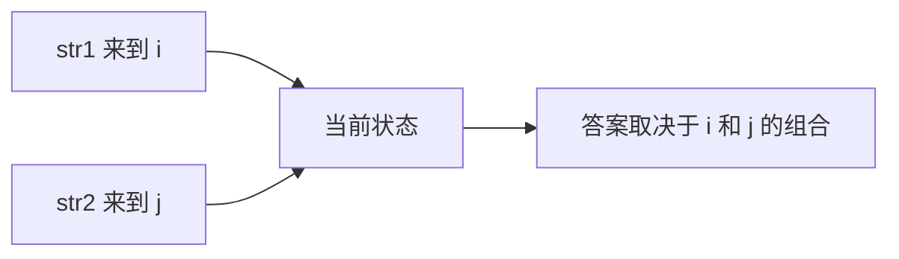
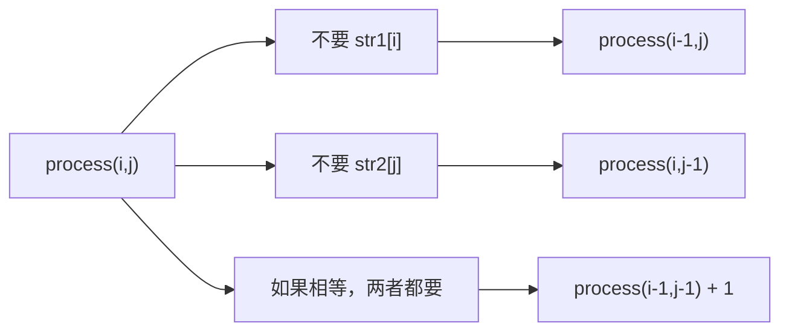

# 多样本位置全对应的尝试模型-最长公共子序列

[返回章节](README.md) | [返回分类](../README.md) | [返回总目录](../../README.md)

- 状态：已标记完成
- 所属分类：基础巩固
- 所属章节：12 暴力递归到动态规划1-递归尝试
- 原始条目：☒ 多样本位置全对应的尝试模型

## 一句话结论
最长公共子序列是“多样本位置全对应模型”的标准代表题。  
这类题的核心不是只看一个位置，而是**多个样本各自走到哪里**，因此状态天然会带多个下标，比如 `i, j`。

## 理论 / 应用价值

### 在知识体系中的位置

```text
递归尝试方法论
  -> 识别四类经典模型
多样本位置全对应
  -> 多个输入样本同步推进
最长公共子序列
  -> 双样本双位置的标准代表题
后续动态规划
  -> 二维表 dp[i][j]
```

### 为什么值得学

1. **它是“双样本递归”最经典的入门题**
   - 一个字符串的位置不够
   - 必须同时描述两个字符串来到哪里

2. **它是二维 DP 的标准前身**
   - 递归状态是 `i, j`
   - 改表后就是 `dp[i][j]`

3. **它能训练“多位置同时约束”的思维**
   - 当前决策不只受一个输入影响
   - 而是取决于两个样本当前位置的组合

### 它解决的核心问题

- 如何在两个字符串中找出最长的公共子序列长度
- 如何把“两个样本同步推进”翻译成递归状态
- 如何区分“子序列”与“子串”这两种不同问题

### 与相邻题型的关系

- 和数字转字母、背包不同，这题不是单样本单位置
- 和纸牌博弈不同，这题的状态不是区间，而是多个样本位置
- 它和后续的二维 DP 高度对应，是多样本位置模型最适合转表的题之一

## 核心知识点
- 目标是求最长公共子序列长度，不是必须输出序列本身
- 状态常写成：
  - `process(i, j)`：`str1[0..i]` 与 `str2[0..j]` 的 LCS 长度
- 常见决策围绕最后一个字符展开
- 如果 `str1[i] == str2[j]`，可以考虑一起要
- 如果不相等，至少有一个最后字符不要

## 图片转写 / 题意还原
这题的标准描述是：

- 给定两个字符串 `str1` 和 `str2`
- 可以分别从两个字符串中删除若干字符，也可以一个都不删
- 删除后保留字符的相对顺序不能改变
- 如果两个字符串都能变成同一个字符串，那么这个字符串就是它们的公共子序列
- 问最长公共子序列的长度是多少

**输入**：
- 两个字符串 `str1`、`str2`

**输出**：
- 一个整数，表示最长公共子序列长度

**注意**：
- 这是“子序列”，不是“子串”
- 子序列可以不连续，但相对顺序必须一致

**示例**：

```text
str1 = "abcde"
str2 = "ace"

最长公共子序列是 "ace"
答案 = 3
```

## 图解

### 为什么状态要带两个位置



**读图抓手**：
- 只知道 `i` 不够，因为还要看 `str2` 当前在哪。
- 只知道 `j` 也不够，因为还要看 `str1` 当前在哪。
- 所以这类题天然是“多样本位置全对应”模型。

### 围绕最后字符的分支



**关键观察**：
- 当两个最后字符不相等时，不可能同时作为公共子序列结尾。
- 当两个最后字符相等时，才有“斜对角 +1”的机会。

## 解题思路

### 为什么这么做
LCS 的关键难点在于：

- 两个字符串都在变化
- 当前答案取决于两个样本最后位置的组合关系

所以最自然的递归定义是：

```text
process(i, j)
```

表示：

- `str1[0..i]`
- `str2[0..j]`

这两段前缀的最长公共子序列长度。

### 怎么做

#### base case

当某一边已经只剩一个字符时，要单独判断：

- 如果 `i == 0`
  - 看 `str1[0]` 是否在 `str2[0..j]` 里出现
- 如果 `j == 0`
  - 看 `str2[0]` 是否在 `str1[0..i]` 里出现

更常见的实现里，也可以把递归改成从后往前并在越界时返回 `0`，但这里保留更贴近课堂的前缀定义。

#### 一般情况

看 `str1[i]` 和 `str2[j]`：

1. **不要 `str1[i]`**

```text
process(i - 1, j)
```

2. **不要 `str2[j]`**

```text
process(i, j - 1)
```

3. **如果 `str1[i] == str2[j]`，两者都要**

```text
process(i - 1, j - 1) + 1
```

最后取最大值。

### 为什么对
因为对于 `str1[0..i]` 和 `str2[0..j]` 的最优答案，最后一个字符只有几种可能：

- 不包含 `str1[i]`
- 不包含 `str2[j]`
- 如果二者相等，也可能二者都作为公共结尾

这些情况合起来覆盖了所有可能，因此递归完整。

## 复杂度
- 纯暴力递归时间复杂度：指数级
- 空间复杂度：递归栈约 `O(N + M)`
- 这题非常适合改成二维 DP

## 典型例子

以：

```text
str1 = "abc"
str2 = "ac"
```

为例：

```text
process(2, 1)
```

也就是比较 `"abc"` 和 `"ac"`。

因为：

- `str1[2] = 'c'`
- `str2[1] = 'c'`

它们相等，所以可以考虑：

```text
process(1, 0) + 1
```

而：

```text
process(1, 0)
```

表示 `"ab"` 和 `"a"` 的最长公共子序列长度，为 `1`。  
所以最终：

```text
process(2, 1) = 2
```

答案就是 `"ac"`。

## 易错点
- 子序列不是子串，不要求连续
- 状态不是一个位置，而是两个位置
- 相等时才有“斜对角 +1”
- 不相等时不是简单地都减一，而是要分别尝试去掉一边

## 代码 / 伪代码

```java
int lcs(char[] str1, char[] str2, int i, int j) {
    if (i == 0 && j == 0) {
        return str1[0] == str2[0] ? 1 : 0;
    }
    if (i == 0) {
        if (str1[0] == str2[j]) {
            return 1;
        }
        return lcs(str1, str2, 0, j - 1);
    }
    if (j == 0) {
        if (str1[i] == str2[0]) {
            return 1;
        }
        return lcs(str1, str2, i - 1, 0);
    }

    int p1 = lcs(str1, str2, i - 1, j);
    int p2 = lcs(str1, str2, i, j - 1);
    int p3 = 0;
    if (str1[i] == str2[j]) {
        p3 = lcs(str1, str2, i - 1, j - 1) + 1;
    }
    return Math.max(p1, Math.max(p2, p3));
}
```

## 记忆点
- 多样本位置全对应，核心就是多个位置参数一起定义状态。
- LCS 是这类模型最标准的代表题。
- 相等看左上角加一，不等看上边和左边。
