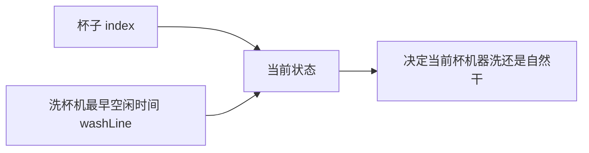
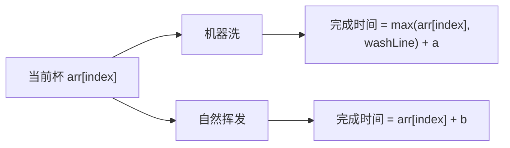
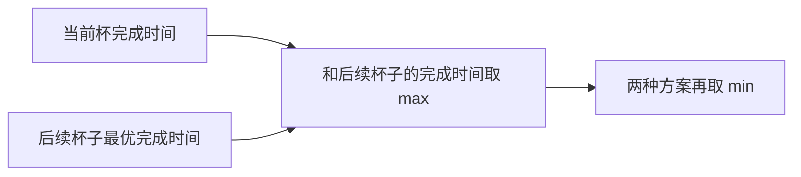

# 寻找业务限制的尝试模型-咖啡杯清洗问题

[返回章节](README.md) | [返回分类](../README.md) | [返回总目录](../../README.md)

- 状态：已标记完成
- 所属分类：基础巩固
- 所属章节：12 暴力递归到动态规划1-递归尝试
- 原始条目：☒ 寻找业务限制的尝试模型（咖啡杯清洗问题）

## 一句话结论
这题最能代表“寻找业务限制模型”的原因是：真正限制状态的，不是杯子下标本身，而是**洗杯机什么时候空出来**。  
每个杯子都可以“机器洗”或“自然挥发”，而递归状态必须把这个业务限制 `washLine` 带上。

## 理论 / 应用价值

### 在知识体系中的位置

```text
递归尝试方法论
  -> 四类经典模型
寻找业务限制
  -> 状态不是题面直接送的
咖啡杯清洗
  -> 业务约束决定状态参数
后续动态规划
  -> process(index, washLine) 改二维表
```

### 为什么值得学

1. **它训练“从业务里抠状态”**
   - 题目不会直接告诉你状态长什么样
   - 需要你先分析真正卡住系统的资源约束

2. **它比普通位置模型更接近真实工程问题**
   - 机器什么时候空出来
   - 资源能不能并行
   - 当前决策会不会影响后续排队

3. **它是更高级的递归建模代表题**
   - 表面上像贪心
   - 实际上是带业务限制参数的递归 / DP

### 它解决的核心问题

- 对每只杯子，如何在“机器洗 / 自然挥发”之间选择
- 如何最小化“最后一只杯子变干净的时间”
- 如何识别真正重要的附加状态不是 `index`，而是 `washLine`

### 与相邻题型的关系

- 和背包问题一样，每个对象都有两种选择
- 但和背包不同，这题真正的额外状态来自业务资源约束
- 和后续 DP 版天然对应，是“业务限制模型”里最经典的入门题之一

## 核心知识点
- 输入 `arr[i]` 表示第 `i` 个杯子最早可处理时间
- 洗杯机一次只能洗一个杯子，耗时 `a`
- 杯子也可自然挥发，耗时 `b`
- 状态定义：
  - `process(index, washLine)`
- 当前杯子的两种决策：
  - 机器洗
  - 自然挥发
- 目标不是总耗时和，而是**所有杯子都干净的最早完成时刻**

## 图片转写 / 题意还原
这题的标准描述是：

- `arr[i]` 表示第 `i` 个人在什么时间喝完咖啡，并把杯子放到待处理区
- 这些杯子从各自喝完的时刻起，才可以开始被处理
- 只有一台洗杯机，一次只能洗一个杯子，洗一只需要时间 `a`
- 每个杯子也可以选择自然挥发变干，耗时固定为 `b`
- 自然挥发彼此互不影响，可以并行发生
- 问怎样安排每只杯子的处理方式，才能让“所有杯子都干净”这个时间点尽量早

**输入**：
- `int[] arr`
- `int a`
- `int b`

**输出**：
- 一个整数，表示所有杯子都干净的最早时间

## 图解

### 这题真正卡住的资源是什么



**读图抓手**：
- 只知道 `index` 不够，因为同样是第 `index` 个杯子，机器何时空闲会直接改变答案。
- 所以这题不能只写 `process(index)`，必须把业务限制带上。

### 当前杯的两种选择



### 最终答案怎么取



## 解题思路

### 为什么这么做
这题的难点不是“杯子按顺序处理”，而是：

- 洗杯机是串行资源
- 自然挥发是并行资源

所以当前决策会不会影响后面，关键要看洗杯机什么时候可用。  
这就是业务限制 `washLine`。

### 怎么做

定义：

```text
process(index, washLine)
```

含义：

- 从 `index` 号杯子开始处理
- 当前洗杯机最早能在 `washLine` 时刻开始工作
- 返回后续所有杯子都变干净的最早完成时间

#### base case

如果已经来到最后一个杯子：

它有两种选择：

1. **机器洗**

```text
max(arr[index], washLine) + a
```

2. **自然挥发**

```text
arr[index] + b
```

取较小值即可。

#### 一般情况

对当前杯子，分两种选择：

##### 选择 1：机器洗

当前杯子真正开始洗的时间是：

```text
max(arr[index], washLine)
```

因为：

- 杯子要先喝完
- 机器也要先空出来

所以当前杯洗完时间：

```text
wash = max(arr[index], washLine) + a
```

接下来后续杯子的状态变成：

```text
process(index + 1, wash)
```

整条方案最终完成时间是：

```text
max(wash, process(index + 1, wash))
```

##### 选择 2：自然挥发

当前杯自然变干时间：

```text
dry = arr[index] + b
```

后续杯子不受机器时间影响，仍然是：

```text
process(index + 1, washLine)
```

整条方案最终完成时间是：

```text
max(dry, process(index + 1, washLine))
```

##### 当前状态答案

两种方案里取较小值：

```text
min(p1, p2)
```

### 为什么对
因为每个杯子只有两种合法处理方式：

- 机器洗
- 自然挥发

而当前杯子的选择只会通过一个关键业务量影响后续：

- 洗杯机下次什么时候空出来

所以 `index + washLine` 正好完整描述了后续问题状态。

## 复杂度
- 纯递归会比较慢，因为 `washLine` 会带来大量状态分支
- 这题通常适合进一步改成 DP
- 暴力递归空间复杂度主要来自递归深度 `O(N)`

## 典型例子

以：

```text
arr = [1, 3]
a = 2
b = 5
```

为例。

### 第 0 个杯子

洗杯机初始空闲时间：

```text
washLine = 0
```

#### 方案 1：机器洗

```text
wash = max(1, 0) + 2 = 3
```

后续状态：

```text
process(1, 3)
```

#### 方案 2：自然挥发

```text
dry = 1 + 5 = 6
```

后续状态：

```text
process(1, 0)
```

这时就能看出：

- 当前杯到底洗还是挥发
- 会直接改变后续杯子的机器等待线

这正是这题为什么必须带 `washLine` 的原因。

## 易错点
- 这题求的是“最后全部干净的最早时刻”，不是所有杯子时间求和
- `washLine` 不是当前杯开始时间，而是洗杯机最早可用时间
- 当前杯机器洗的开始时刻要写成 `max(arr[index], washLine)`
- 当前答案不是简单相加，而是先和后续取 `max`，再在两种方案间取 `min`

## 代码 / 伪代码

```java
int process(int[] arr, int a, int b, int index, int washLine) {
    if (index == arr.length - 1) {
        int p1 = Math.max(arr[index], washLine) + a;
        int p2 = arr[index] + b;
        return Math.min(p1, p2);
    }

    int wash = Math.max(arr[index], washLine) + a;
    int next1 = process(arr, a, b, index + 1, wash);
    int p1 = Math.max(wash, next1);

    int dry = arr[index] + b;
    int next2 = process(arr, a, b, index + 1, washLine);
    int p2 = Math.max(dry, next2);

    return Math.min(p1, p2);
}
```

## 记忆点
- 业务限制模型的关键，是先找到真正限制后续决策的那个量。
- 咖啡杯问题里，这个量就是 `washLine`。
- 每杯两种决策：机器洗 / 自然干。
- 当前状态答案：两种方案取 `min`，每种方案内部先取 `max`。
