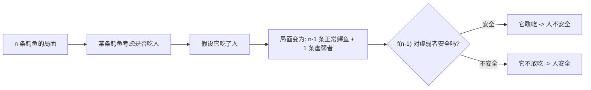
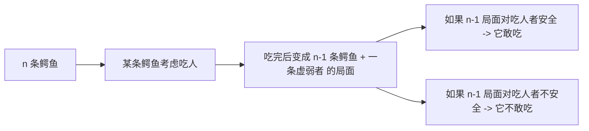
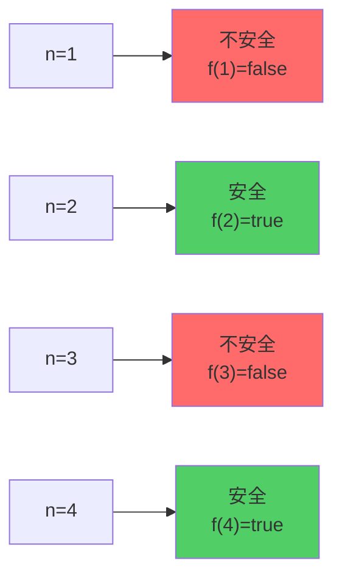

# 课前小练1-鳄鱼吃人问题

[返回章节](README.md) | [返回分类](../README.md) | [返回总目录](../../README.md)

- 状态：已标记完成
- 所属分类：基础巩固
- 所属章节：12 暴力递归到动态规划1-递归尝试
- 原始条目：☒ 课前小练1-鳄鱼吃人

## 一句话结论
这题本质是一个“安全 / 不安全”状态递推题。  
按最常见经典题面整理后，结论是：**鳄鱼数量为偶数时，人安全；为奇数时，人不安全**。

## 理论 / 应用价值
- **理论位置**：这是"暴力递归到动态规划"章节的课前热身题，不依赖复杂算法模板，纯粹训练状态建模和递推思维。
- **解决的问题**：如何把看似复杂的博弈场景抽象成简单的布尔状态递推，识别出"当前决策取决于后继状态"这一核心模式。
- **为什么值得学**：
  - 这类"理性参与者博弈"题目在面试中常作为思维题出现，考察的是能否快速抓住状态转移本质。
  - 它展示了动态规划思想的雏形：大问题拆成小问题，当前状态由子状态决定。
  - 学会从"谁敢做某事"反推到"做了之后会不会更危险"，这种逆向思维在很多博弈、游戏类题目中都适用。

## 核心知识点
- **状态定义**：`f(n)` 表示有 n 条鳄鱼时，人是否安全（true/false）
- **决策逻辑**：每条鳄鱼都是理性的，只有当"吃掉人后自己仍安全"时才会行动
- **递推关系**：`f(n) = !f(n - 1)`，当前局面安全性与少一条鳄鱼的局面相反
- **奇偶规律**：从 base case 出发交替翻转，最终呈现"偶数安全、奇数不安全"的规律

## 图片转写 / 题意还原

### 完整题目描述

**场景设定**：
- 河里有 `n` 条鳄鱼，它们都绝顶聪明且完全理性
- 一个人需要过河，任何一条鳄鱼都能单独吃掉这个人
- 但当一条鳄鱼吃掉人后，它会变得虚弱，可能被其他鳄鱼吃掉
- 所有鳄鱼都知道彼此的存在，也都知道这个规则

**关键规则**：
1. 每条鳄鱼的首要目标是保全自己的性命
2. 鳄鱼不会做任何让自己陷入危险的事（即不会被其他鳄鱼吃掉）
3. 如果吃掉人后自己是安全的，它就会吃；否则就不吃
4. 所有鳄鱼同时具备相同的推理能力（共同知识）

**问题**：给定 n 条鳄鱼，判断人是否能安全过河？

**输入**：正整数 n（鳄鱼数量）
**输出**：布尔值（人是否安全）
**约束**：n ≥ 1

### 抽象化表述

这题本质上是在问：
```text
定义 f(n) = 有 n 条鳄鱼时，局面对人是否安全
求 f(n) 的值
```

其中"安全"的含义是：没有任何一条鳄鱼会选择吃掉人。

## 图解

### 决策流程图



### 状态递推链



### 小样本枚举表



## 解题思路

### 为什么这么做：从具体到抽象的思维过程
这题的难点不在于"河"或"鳄鱼"这些表面元素，而在于理解：
- 鳄鱼不是无脑捕食者，它们是理性决策者
- 每条鳄鱼的决策依据是："我吃了人之后，我自己会不会死？"
- 这个问题的答案恰好就是规模为 n-1 的同类型问题

所以最自然的建模方式是定义一个布尔函数：
```text
f(n) = 有 n 条鳄鱼时，人是否安全（true=安全，false=不安全）
```

然后通过分析小规模情况，找出递推规律。

### 怎么做：从小样本开始归纳

#### Step 1: 确定 Base Case

**n = 1 的情况**：
- 只有 1 条鳄鱼，它吃掉人后没有其他鳄鱼能吃它
- 所以它会毫不犹豫地吃掉人 → **人不安全**
- `f(1) = false`

**n = 2 的情况**：
- 假设有鳄鱼 A 和 B
- 如果 A 吃掉人，A 会变虚弱，B 就能轻松吃掉 A
- A 知道这一点，所以 A 不敢吃人
- 同理，B 也不敢吃人
- 结果：两条鳄鱼都不敢动 → **人安全**
- `f(2) = true`

#### Step 2: 推导递推关系

对于一般的 n 条鳄鱼，考虑其中任意一条鳄鱼 X 的决策：

**X 的思考过程**：
1. "如果我吃掉人，我会变虚弱"
2. "剩下的 n-1 条正常鳄鱼会怎么对我？"
3. "这正好就是 f(n-1) 要回答的问题！"

**两种情况**：
- **如果 f(n-1) = true（对虚弱者安全）**：
  - 说明在 n-1 条鳄鱼的局面下，虚弱者是安全的（不会被吃）
  - X 判断："我吃了人后仍然安全" → X 会吃人 → **人不安全**
  - 所以 `f(n) = false`

- **如果 f(n-1) = false（对虚弱者不安全）**：
  - 说明在 n-1 条鳄鱼的局面下，虚弱者会被吃掉
  - X 判断："我吃了人后会死" → X 不敢吃人 → **人安全**
  - 所以 `f(n) = true`

**总结递推公式**：
```text
f(n) = !f(n - 1)
```

也就是说，相邻两个规模的局面安全性必然相反。

#### Step 3: 得出通项公式

从 `f(1) = false` 开始，利用 `f(n) = !f(n-1)` 逐步展开：

```
f(1) = false  （奇数，不安全）
f(2) = true   （偶数，安全）
f(3) = false  （奇数，不安全）
f(4) = true   （偶数，安全）
f(5) = false  （奇数，不安全）
...
```

**最终结论**：
- 当 n 为**偶数**时，`f(n) = true`，人**安全**
- 当 n 为**奇数**时，`f(n) = false`，人**不安全**
- 等价于：`f(n) = (n % 2 == 0)`

### 为什么对：正确性证明
**数学归纳法证明**：

**Base Case**：
- n=1 时，唯一一条鳄鱼会吃人，人不安全，`f(1)=false` ✓
- n=2 时，两条鳄鱼互相制衡，都不敢吃人，人安全，`f(2)=true` ✓

**Inductive Step**：
- 假设对于 n-1 条鳄鱼，结论成立（即 f(n-1) 的奇偶规律正确）
- 对于 n 条鳄鱼，任意一条鳄鱼 X 的决策完全取决于 f(n-1)
- 根据递推关系 `f(n) = !f(n-1)`，f(n) 与 f(n-1) 相反
- 因此奇偶交替的规律对 n 也成立 ✓

**直观理解**：
- 每条鳄鱼的决策都基于"吃了之后自己会不会死"
- 而这个"会不会死"恰好就是规模减 1 的同类型问题
- 所以整个系统天然形成递推结构，状态在"安全/不安全"之间交替翻转

## 复杂度分析
- **暴力递归写法**：时间复杂度 `O(n)`，需要递归 n 层
- **直接判断奇偶**：时间复杂度 `O(1)`，只需一次取模运算
- **空间复杂度**：`O(1)`，无论哪种方法都只需要常数额外空间

## 典型例子：详细推演

### 案例 1：n = 1（最简单情况）

```
场景：河里只有 1 条鳄鱼
思考：这条鳄鱼想"我吃了人后，还有其他鳄鱼会吃我吗？"
答案：没有别的鳄鱼了，所以我吃了人后很安全 → 它会吃
结果：人不安全，f(1) = false
```

### 案例 2：n = 2（第一次反转）

```
场景：河里有 2 条鳄鱼 A 和 B
A 的思考：
  - "如果我吃了人，我会变虚弱"
  - "剩下 1 条正常鳄鱼 B，它会吃掉虚弱的我吗？"
  - "根据 f(1)=false，在 1 条鳄鱼的局面下，人是危险的"
  - "换句话说，虚弱的我会被 B 吃掉 → 我不敢吃"
B 的思考：同理，B 也不敢吃
结果：两条鳄鱼都不敢动，人安全，f(2) = true
```

### 案例 3：n = 3（再次反转）

```
场景：河里有 3 条鳄鱼 A、B、C
A 的思考：
  - "如果我吃了人，剩下 2 条正常鳄鱼 B 和 C"
  - "根据 f(2)=true，在 2 条鳄鱼的局面下，虚弱的我是安全的"
  - "B 和 C 会互相制衡，都不敢吃虚弱的我"
  - "所以我吃了人后仍然安全 → 我会吃"
结果：A（或任意一条鳄鱼）会吃人，人不安全，f(3) = false
```

### 案例 4：n = 4（继续交替）

```
场景：河里有 4 条鳄鱼
任意一条鳄鱼的思考：
  - "如果我吃了人，剩下 3 条正常鳄鱼"
  - "根据 f(3)=false，在 3 条鳄鱼的局面下，虚弱的我不安全"
  - "那 3 条鳄鱼中会有某条吃掉虚弱的我"
  - "所以我不能吃人"
结果：所有鳄鱼都不敢吃，人安全，f(4) = true
```

### 规律总结表

| n | f(n) | 含义 | 原因 |
|---|------|------|------|
| 1 | false | 不安全 | 唯一鳄鱼无后顾之忧，必吃 |
| 2 | true  | 安全   | 两条鳄鱼互相制衡，都不敢吃 |
| 3 | false | 不安全 | 吃人者在 2 条局面下安全，所以敢吃 |
| 4 | true  | 安全   | 吃人者在 3 条局面下危险，所以不敢吃 |
| 5 | false | 不安全 | 吃人者在 4 条局面下安全，所以敢吃 |
| ... | ... | ... | 依此类推，奇偶交替 |

## 易错点与注意事项
- **误区 1：被情境带偏**
  - 不要纠结"河有多宽""鳄鱼有多大"这些无关细节
  - 核心是抽象出"理性参与者的博弈决策"这个模型
  
- **误区 2：记反结论**
  - 一定要从 base case `f(1)=false` 开始推导，不要凭印象记忆
  - 记住：**偶数安全，奇数不安全**（可以联想：双数=成对=互相制衡=安全）
  
- **误区 3：混淆"人安全"和"鳄鱼安全"**
  - `f(n)` 定义的是"人对否安全"，不是"某条鳄鱼是否安全"
  - 递推时要想清楚：鳄鱼判断的是"我吃人后**我自己**是否安全"
  
- **误区 4：忽略"共同知识"假设**
  - 题目隐含所有鳄鱼都知道彼此的存在和规则
  - 所有鳄鱼都有相同的推理能力（这是博弈论的标准假设）
  - 如果缺少这个假设，问题会变得复杂得多

## 代码实现

```java
/**
 * 判断 n 条鳄鱼时人是否安全
 * @param n 鳄鱼数量
 * @return true=安全，false=不安全
 */
boolean isSafe(int n) {
    return (n % 2 == 0);
}
```

### 递归写法（体现递推思想）

```java
/**
 * 递归版本：体现 f(n) = !f(n-1) 的递推关系
 */
boolean isSafeRecursive(int n) {
    // Base case
    if (n == 1) {
        return false;  // 1 条鳄鱼时人不安全
    }
    // Recursive case: f(n) = !f(n-1)
    return !isSafeRecursive(n - 1);
}
```

### 迭代写法（避免递归栈溢出）

```java
/**
 * 迭代版本：从 f(1) 开始逐步推导到 f(n)
 */
boolean isSafeIterative(int n) {
    boolean safe = false;  // f(1) = false
    for (int i = 2; i <= n; i++) {
        safe = !safe;  // f(i) = !f(i-1)
    }
    return safe;
}
```

### 代码位置参考

如果仓库中有对应实现，可参考：
- Java 实现：`solutions-java/practice/recursion/CrocodileProblem.java`（如存在）
- Python 实现：`solutions-python/java2python/crocodile_problem.py`（如存在）

> 注：本题作为思维题，代码极其简单，重点在于理解递推关系的建立过程。

## 记忆点
- **核心递推**：`f(n) = !f(n-1)`，当前局面与少一条鳄鱼的局面安全性相反
- **判断条件**：从 `f(1)=false` 出发，奇偶交替翻转
- **最终结论**：**偶数安全，奇数不安全**（记：双数成对制衡）
- **思维模式**：遇到"理性参与者博弈"题，先定义状态，再找"当前决策依赖的后继状态"
