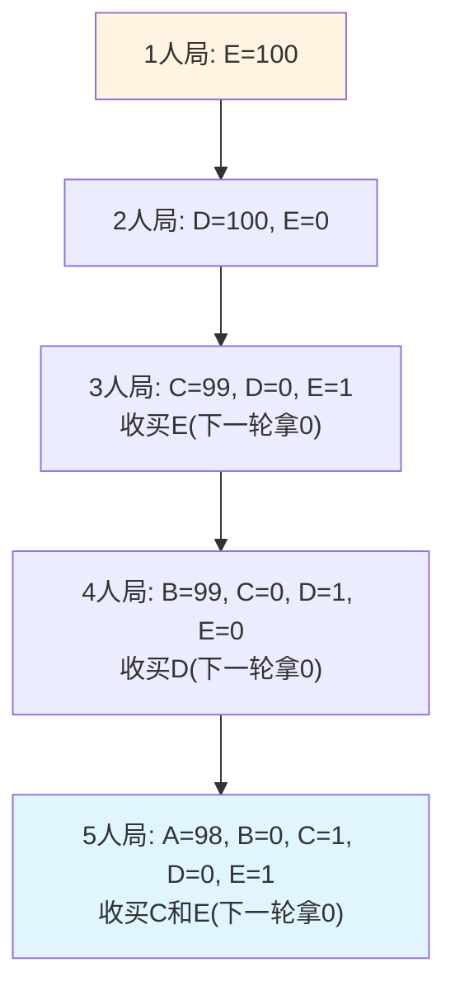
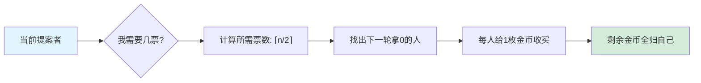

# 课前小练-海盗分金问题

[返回章节](README.md) | [返回分类](../README.md) | [返回总目录](../../README.md)

- 状态：已标记完成
- 所属分类：基础巩固
- 所属章节：12 暴力递归到动态规划1-递归尝试
- 原始条目：☒ 课前小练-海盗分金

## 一句话结论
海盗分金的核心不是算术，而是**逆向归纳**。  
本笔记按最常见经典版整理：5 个海盗、100 枚金币、赞成票达到半数及以上即通过，最终最优分配是 **`98, 0, 1, 0, 1`**。

## 理论 / 应用价值
- **博弈论基石：** 这题是逆向归纳法（Backward Induction）在博弈论中的教科书级案例。
- **思维训练：** 它打破了常规的“正向思考”习惯，强制要求从终局状态倒推当前决策。
- **状态定义能力：** 它是理解动态规划中“子问题”概念的绝佳铺垫——当前的最优解取决于未来子局面的结果。
- **工程迁移：** 在处理多阶段决策、资源分配或具有先后手优势的算法题时，这种“看两步想一步”的思维非常关键。

## 核心知识点
- **理性人假设（偏好优先级）：**
  1. 活命（最高优先级）
  2. 多拿金币（次高优先级）
  3. 杀人取乐（在前两者相同时，倾向于看到别人死）
- **逆向归纳法：** 从人数最少的情况（Base Case）开始推导，逐步增加人数。
- **半数规则：** 赞成票 $\ge$ 总人数的一半即可通过（包含提案者自己的票）。
- **收买策略：** 提案者只需用最小的代价（1枚金币）收买那些在“下一轮”中收益最差的人。

## 图片转写 / 题意还原
本笔记采用最常见的经典题面：

- 5 个海盗抢到 100 枚金币
- 按地位从高到低依次编号 `A, B, C, D, E`
- 当前地位最高的海盗提出分配方案
- 全体海盗投票，包括提案者自己
- **只要赞成票达到半数及以上，方案就通过**
- 如果方案不通过，提案者被处死，剩下的人继续按同样规则分
- 所有人都绝顶理性，且偏好顺序是：
  - 活命
  - 多拿钱
  - 若前两者相同，更愿意别人死

问题是：

```text
A 应该提出怎样的分配方案
才能让自己活下来
并且拿到尽可能多的金币
```

## 图解

### 逆向推理流程（从后往前推）



### 核心决策逻辑



## 解题思路

### 为什么这么做
这题不能从 5 个人直接硬想，因为当前人的选择依赖“自己死后别人会怎么分”。  
所以必须从最小规模开始，层层往回推。

### 怎么做

#### 1 人局

只剩 `E`：

```text
E = 100
```

#### 2 人局

只剩 `D, E`，只要半数及以上通过。  
2 人局里，`D` 自己 1 票就够了，所以：

```text
D = 100
E = 0
```

#### 3 人局

只剩 `C, D, E`。  
如果 `C` 死了，下一轮是：

```text
D = 100
E = 0
```

所以 `C` 只要给 `E` 1 枚，`E` 就会支持他：

```text
C = 99
D = 0
E = 1
```

#### 4 人局

只剩 `B, C, D, E`。  
如果 `B` 死了，下一轮是：

```text
C = 99
D = 0
E = 1
```

4 人局需要 2 票，`B` 自己已经有 1 票，只需再买 1 票。  
下一轮最吃亏的是 `D`，因为他只能拿 `0`，于是：

```text
B = 99
C = 0
D = 1
E = 0
```

#### 5 人局（最终局面）

现在回到 `A, B, C, D, E`。  
如果 `A` 死了，下一轮是：

```text
B = 99
C = 0
D = 1
E = 0
```

5 人局需要 3 票，`A` 自己算 1 票，还需要再买 2 票。  
下一轮最吃亏的是 `C` 和 `E`，因为他们都只能拿 `0`，所以各给 1 枚即可：

```text
A = 98
B = 0
C = 1
D = 0
E = 1
```

#### 状态转移逻辑（以 $n$ 人局为例）

1.  **观察子局面：** 查看 $n-1$ 人局时的分配方案。
2.  **寻找廉价票：** 找出在 $n-1$ 人局中分到 `0` 金币的海盗。
3.  **计算成本：** 给这些海盗各 `1` 枚金币，他们就会支持你（因为比下一轮好）。
4.  **确定票数：** 需要凑够 $\lceil n/2 \rceil$ 张赞成票。
5.  **剩余归己：** 剩下的金币全部留给提案者自己。

### 为什么对
因为每一轮海盗都会拿“下一轮自己能得到什么”来比较当前方案。  
于是提案者的最优策略一定是：

- 先看自己死后会发生什么
- 再用最小代价收买那些在下一轮里最吃亏的人

这就是逆向归纳法的核心。

## 复杂度
- **时间复杂度：** 若推广到 $n$ 人，需要逆推 $n$ 层，每层遍历寻找廉价票，约为 $O(n^2)$。
- **空间复杂度：** 记录每一轮的分配方案，约为 $O(n^2)$。

## 典型例子

### 为什么 `A` 不需要给 `D` 钱

因为如果 `A` 死了，4 人局里：

```text
D = 1
```

那么 `A` 想买 `D` 的票，至少要给 `2`。  
但 `C` 和 `E` 在下一轮都只能拿 `0`，给他们各 `1` 就够了，所以更便宜。

## 易错点
- 先明确投票规则，经典版是“半数及以上通过”；不同版本答案会变
- 先明确偏好顺序，不同偏好顺序也会改答案
- 不是收买“最强的人”，而是收买“下一轮最吃亏的人”
- 这题的关键是倒推，不是正推

## 代码 / 伪代码
虽然这题通常手算，但其逻辑可以转化为标准的 DP 递推：

```java
// 伪代码：计算 n 个海盗分 m 枚金币的方案
int[] solve(int n, int m) {
    // dp[i] 存储 i 个人时的分配数组
    if (n == 1) return new int[]{m}; 
    
    int[] prev = solve(n - 1, m); // 拿到 n-1 人局的方案
    int[] curr = new int[n];
    
    // 1. 找出在上一轮拿 0 的人（这些人最便宜）
    List<Integer> cheapVotes = new ArrayList<>();
    for (int i = 0; i < prev.length; i++) {
        if (prev[i] == 0) cheapVotes.add(i);
    }
    
    // 2. 计算需要的票数：ceil(n / 2) - 1 (减去自己的一票)
    int need = (n + 1) / 2 - 1;
    
    // 3. 收买最便宜的 need 个人
    int cost = 0;
    for (int i = 0; i < need; i++) {
        int idx = cheapVotes.get(i);
        curr[idx + 1] = 1; // 对应原海盗编号偏移
        cost += 1;
    }
    
    // 4. 剩下的全给自己
    curr[0] = m - cost;
    return curr;
}
```

## 记忆点
- **逆向思维：** 永远从最后一个人往前推。
- **收买原则：** 谁在下一轮混得最惨（拿0），就收买谁。
- **经典结论：** 5人100金，答案为 `98, 0, 1, 0, 1`。
- **状态转移：** 当前方案是基于“下一轮方案”的最优反击。
