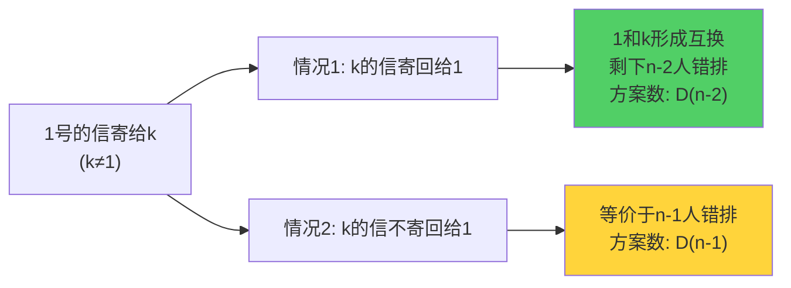
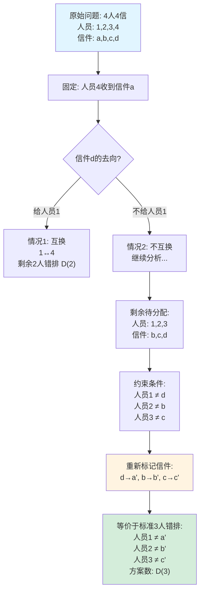

# 课前小练3-村民寄信问题

[返回章节](README.md) | [返回分类](../README.md) | [返回总目录](../../README.md)

- 状态：已标记完成
- 所属分类：基础巩固
- 所属章节：12 暴力递归到动态规划1-递归尝试
- 原始条目：☒ 课前小练3-村民寄信

## 一句话结论
村民寄信问题本质上就是经典**错排问题**。  
如果有 `n` 个村民互寄信，并且每个人都不能收到自己的信，那么方案数记为 `D(n)`，满足递推：

```text
D(n) = (n - 1) * (D(n - 1) + D(n - 2))
```

## 理论 / 应用价值
- **理论位置**：这是组合数学中的经典错排问题（Derangement），也是"暴力递归到动态规划"章节的计数类热身题。
- **解决的问题**：如何把"每个人都不能收到自己的信"这个约束条件转化为排列计数的递推模型。
- **为什么值得学**：
  - 这类题目训练的是"从故事场景抽象出数学模型"的能力，是算法面试中常见的思维题类型。
  - 错排问题是理解容斥原理、递推关系的重要入口，后续可以延伸到更复杂的组合计数问题。
  - 它展示了如何通过"固定一个元素，分类讨论剩余结构"来建立递推关系，这种思路在很多计数问题中都适用。

## 核心知识点
- **错排定义**：n 个元素的排列中，每个元素都不在原来位置的排列称为错排
- **记号约定**：通常写作 `D(n)` 或 `!n`（subfactorial）
- **Base Case**：
  - `D(1) = 0`（1 个人无法错排）
  - `D(2) = 1`（2 个人只能互换）
- **递推公式**：`D(n) = (n - 1) * (D(n - 1) + D(n - 2))`
- **关键思想**：固定第 1 个元素的去向，分两类讨论后续结构

## 图片转写 / 题意还原

### 完整题目描述

**场景设定**：
- 有 `n` 个村民，每个人都写了一封信
- 这些信会被随机分发给这 `n` 个村民（每人一封）
- 要求：**没有任何一个人收到自己写的信**

**问题**：一共有多少种不同的合法寄信方案？

**输入**：正整数 n（村民数量，n ≥ 1）
**输出**：整数（合法方案数）
**约束**：
- 每封信必须寄出且只能寄给一个人
- 每个人必须收到一封信
- 任何人都不能收到自己的信

### 抽象化表述

这题本质上是在问：
```text
求 n 个元素的错排数 D(n)
即：有多少种排列 π，使得对于所有 i ∈ [1, n]，都有 π(i) ≠ i
```

用排列的语言说，就是求没有不动点（fixed point）的排列数量。

## 图解

### 决策树：固定 1 号村民的信的去向


### 两种情况分类讨论



### 情况 2 的等价转化详解（以 n=4, k=4 为例）



## 解题思路

### 为什么这么做：从固定元素入手简化问题
直接计算 n 个人的错排方案数比较困难，因为约束条件涉及所有人。

但如果我们**固定第 1 个人的信寄给谁**，就能把大问题分解成两个互斥的小情况，从而建立递推关系。这种"固定一个元素，分类讨论剩余结构"的思路是组合计数中的常用技巧。

### 怎么做：逐步推导递推公式

设 `D(n)` 表示 n 个人都不收到自己信的方案数（即 n 个元素的错排数）。

#### Step 1: 确定 Base Case

**n = 1 的情况**：
- 只有 1 个人，他只能收到自己的信
- 无法满足"不收到自己的信"的要求
- `D(1) = 0`

**n = 2 的情况**：
- 有 2 个人 A 和 B
- 唯一的合法方案是：A 的信给 B，B 的信给 A（互换）
- `D(2) = 1`

#### Step 2: 分析第 1 个人的选择

考虑第 1 个人的信：
- 他不能寄给自己，所以只能寄给剩下的 `n-1` 个人中的某一个
- 假设他寄给了第 `k` 个人（k ∈ {2, 3, ..., n}）
- 这一步有 **`n-1` 种选择**

接下来，根据第 `k` 个人的信的去向，分为两种互斥的情况：

##### 情况 1：k 的信寄回给 1（形成互换）

**局面分析**：
- 1 的信 → k
- k 的信 → 1
- 1 和 k 形成了一个二元互换

**剩余问题**：
- 剩下的 `n-2` 个人（排除 1 和 k）需要继续错排
- 方案数为 `D(n-2)`

**图示**：
```
1 ↔ k  （互换）
剩余 n-2 人错排
```

##### 情况 2：k 的信不寄回给 1（不形成互换）

**局面分析**：
- 1 的信 → k（已确定）
- k 的信 → 不能是 1，也不能是 k（自己）
- 剩余的 n-2 个人的信也有各自的约束

**关键转化**：
这个问题可以等价地看作"n-1 个人的错排问题"：
- 现在的问题是剩余的 n-1 个村民（排除村民k） 与 n-1 个信封（排除信封1），如何分配？
- 村民1 不能收到 信封k
- 其他 n-2 个村民，每个人都不能收到自己的信
- 这等价于规模为 n-1 的错排问题

**方案数**：`D(n-1)`

**直观理解**：
```
1 的信已经寄给 k
k 的信不能寄回 1，相当于 k 也失去了"原位置"
剩余 n-1 个人（含 k）形成新的错排结构
```

综合以上分析：
- 第 1 个人的信有 `n-1` 种选择（寄给 k）
- 对于每种选择，后续有两种情况：
  - 情况 1：`D(n-2)` 种方案
  - 情况 2：`D(n-1)` 种方案

因此总方案数为：
```text
D(n) = (n - 1) * (D(n - 1) + D(n - 2))
```

这个递推公式的含义是：**首步选择数 × 每种选择下的后续方案数之和**。

### 为什么对：正确性证明
**互斥性**：
- 情况 1 和情况 2 是互斥的：k 的信要么寄回给 1，要么不寄回给 1，两者不能同时发生

**完备性**：
- 这两种情况覆盖了所有可能：k 的信只有"寄回给 1"和"不寄回给 1"两种选择

**等价性**：
- 情况 1 中，1 和 k 互换后，剩余 n-2 人的错排与原问题独立，方案数确实是 `D(n-2)`
- 情况 2 中，通过"位置压缩"的技巧，可以证明这等价于 n-1 人的错排问题，方案数是 `D(n-1)`

**数学归纳法验证**：
- Base Case：`D(1)=0`, `D(2)=1` 已验证
- Inductive Step：假设 `D(k)` 对所有 `k < n` 成立，则根据递推公式计算的 `D(n)` 也正确

因此递推公式成立。

## 复杂度分析
- **纯递归写法**：时间复杂度 `O(2^n)`，存在大量重复计算
- **记忆化搜索**：时间复杂度 `O(n)`，每个状态只计算一次
- **动态规划（递推）**：时间复杂度 `O(n)`，自底向上填表
- **空间复杂度**：
  - 全表存储：`O(n)`
  - 滚动优化（只保留前两项）：`O(1)`

## 典型例子：详细推演

### 案例 1：n = 1（边界情况）

```
只有 1 个人 A
A 只能收到自己的信
无法错排
D(1) = 0 ✓
```

### 案例 2：n = 2（最小可错排）

```
有 2 个人 A 和 B
唯一的合法方案：A→B, B→A（互换）
D(2) = 1 ✓
```

### 案例 3：n = 3（第一次应用递推）

```
有 3 个人 A, B, C

合法方案只有 2 种：
方案1: A→B, B→C, C→A  （轮换）
方案2: A→C, C→B, B→A  （反向轮换）

D(3) = 2 ✓

代入递推验证：
D(3) = (3-1) * (D(2) + D(1))
     = 2 * (1 + 0)
     = 2 ✓
```

### 案例 4：n = 4（递推展开）

```
D(4) = (4-1) * (D(3) + D(2))
     = 3 * (2 + 1)
     = 9

手动验证（部分列举）：
1→2, 2→1, 3→4, 4→3  （两对互换）
1→2, 2→3, 3→4, 4→1  （四元轮换）
1→2, 2→4, 4→3, 3→1  （另一种轮换）
...
共 9 种方案 ✓
```

### 案例 5：n = 5（继续增长）

```
D(5) = (5-1) * (D(4) + D(3))
     = 4 * (9 + 2)
     = 44
```

### 错排数列表

| n | D(n) | 说明 |
|---|------|------|
| 1 | 0 | 无法错排 |
| 2 | 1 | 唯一互换 |
| 3 | 2 | 两种轮换 |
| 4 | 9 | 9 种方案 |
| 5 | 44 | 快速增长 |
| 6 | 265 | |
| 7 | 1854 | |
| 8 | 14833 | |
| 9 | 133496 | |
| 10 | 1334961 | |

> 注：错排数增长非常快，接近 `n!/e`（其中 e ≈ 2.71828）

## 易错点与注意事项
- **误区 1：混淆错排与普通排列**
  - 普通排列数是 `n!`，错排数 `D(n)` 远小于 `n!`
  - 错排的约束更强：每个元素都不能在原位置
  
- **误区 2：Base Case 记错**
  - `D(1) = 0`（不是 1！）
  - `D(2) = 1`（不是 2！）
  - 一定要从实际场景出发理解，不要死记硬背
  
- **误区 3：忘记乘以 `(n-1)`**
  - 递推公式是 `D(n) = (n-1) * (D(n-1) + D(n-2))`
  - 前面的 `(n-1)` 是第 1 个人的选择数，很容易漏掉
  
- **误区 4：不理解情况 2 的等价转换**
  - 情况 2 中为什么是 `D(n-1)` 而不是其他值？
  - 关键是理解"位置压缩"：当 1 的信寄给 k，且 k 的信不寄回给 1 时，问题等价于 n-1 个人的错排
  - 建议多画几个小例子（如 n=3, n=4）来直观理解
  
- **误区 5：数值溢出**
  - 错排数增长极快，`D(20)` 已经超过 `10^17`
  - 在实际编程中要注意使用足够大的数据类型（如 long 或 BigInteger）

## 代码实现

### 最优解：动态规划（滚动优化）

```java
/**
 * 计算 n 个元素的错排数 D(n)
 * 使用滚动数组优化，空间复杂度 O(1)
 * 
 * @param n 元素个数
 * @return 错排数
 */
long derangement(int n) {
    if (n == 1) return 0;
    if (n == 2) return 1;
    
    long prev2 = 0;  // D(1)
    long prev1 = 1;  // D(2)
    long cur = 0;
    
    for (int i = 3; i <= n; i++) {
        cur = (i - 1) * (prev1 + prev2);
        prev2 = prev1;
        prev1 = cur;
    }
    
    return cur;
}
```

### 动态规划（全表存储）

```java
/**
 * 计算 n 个元素的错排数 D(n)
 * 使用数组存储所有中间结果，方便查询任意 D(k)
 * 
 * @param n 元素个数
 * @return 错排数
 */
long derangementWithTable(int n) {
    if (n == 1) return 0;
    if (n == 2) return 1;
    
    long[] dp = new long[n + 1];
    dp[1] = 0;
    dp[2] = 1;
    
    for (int i = 3; i <= n; i++) {
        dp[i] = (i - 1) * (dp[i - 1] + dp[i - 2]);
    }
    
    return dp[n];
}
```

### 记忆化搜索（自顶向下）

```java
import java.util.HashMap;
import java.util.Map;

/**
 * 记忆化搜索版本
 * 避免纯递归的重复计算
 */
class DerangementMemo {
    private Map<Integer, Long> memo = new HashMap<>();
    
    public long D(int n) {
        // 查缓存
        if (memo.containsKey(n)) {
            return memo.get(n);
        }
        
        // Base case
        if (n == 1) {
            memo.put(1, 0L);
            return 0;
        }
        if (n == 2) {
            memo.put(2, 1L);
            return 1;
        }
        
        // 递归计算并缓存
        long result = (n - 1) * (D(n - 1) + D(n - 2));
        memo.put(n, result);
        return result;
    }
}
```

### 纯递归（仅用于理解，不推荐实际使用）

```java
/**
 * 纯递归版本
 * 时间复杂度 O(2^n)，存在大量重复计算
 * 仅用于理解递推关系，实际应用中应使用 DP 或记忆化
 */
long D_naive(int n) {
    if (n == 1) return 0;
    if (n == 2) return 1;
    return (n - 1) * (D_naive(n - 1) + D_naive(n - 2));
}
```

## 记忆点
- **问题本质**：村民寄信 = 错排问题 = 无不动点的排列
- **Base Case**：`D(1)=0`, `D(2)=1`（从实际场景理解，不要死记）
- **核心递推**：`D(n) = (n-1) * (D(n-1) + D(n-2))`（别忘了前面的系数！）
- **推导技巧**：固定第 1 个元素，分"互换"和"不互换"两类讨论
- **增长特性**：错排数增长极快，约等于 `n!/e`，注意数值溢出
