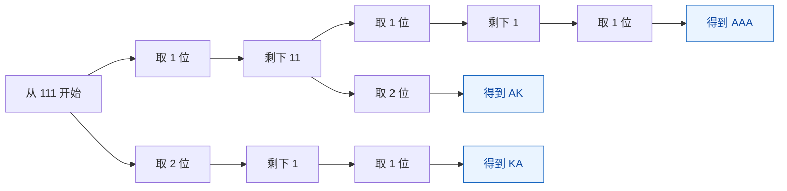
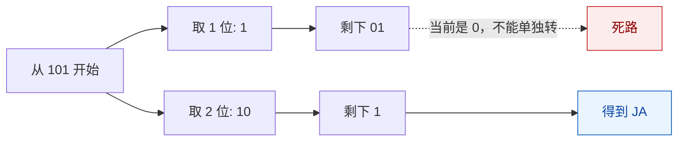
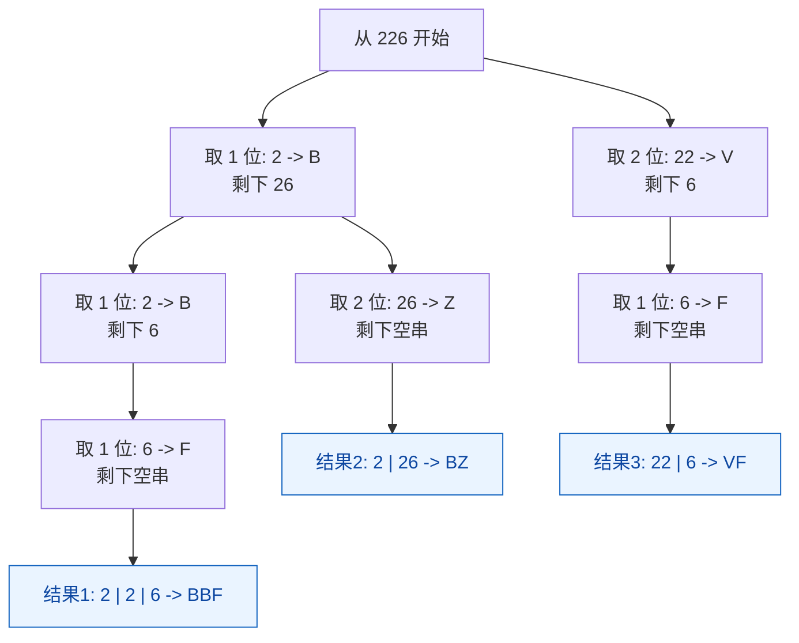
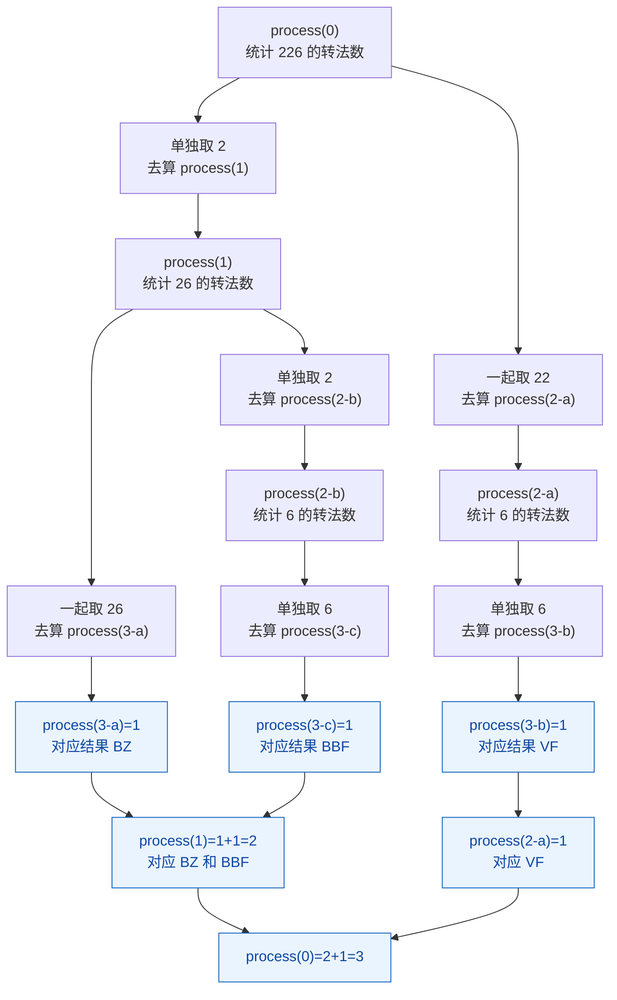

# 从左往右的尝试模型1-数字转字母

[返回章节](README.md) | [返回分类](../README.md) | [返回总目录](../../README.md)

- 状态：已标记完成
- 所属分类：基础巩固
- 所属章节：13 暴力递归到动态规划2-尝试模型
- 原始条目：☒ 从左往右的尝试模型1，Facebook面试原题（此题可以理解为分支限界）

## 一句话结论
这题是“从左往右的尝试模型”最经典的入门题：来到某个位置时，只需要决定当前取 `1` 位，还是合法时取 `2` 位。  
递归状态只有一个 `index`，因此它既适合训练递归建模，也非常适合后续改成记忆化搜索和动态规划。

## 理论 / 应用价值

### 在知识体系中的位置

```text
暴力递归入门
  -> 学会写 base case 和递归展开
从左往右的尝试模型
  -> 每次只关心当前位置怎么决策
数字转字母
  -> 1位尝试 / 2位尝试
改记忆化搜索、动态规划
  -> 状态压缩成 dp[index]
```

### 为什么值得学

1. **它是“从左往右模型”的标准样板**
   - 每次处理当前位置
   - 决策做完后，把问题交给右侧剩余部分

2. **它能帮你建立“状态只和位置有关”的意识**
   - 递归函数只需要一个参数 `index`
   - 这类题通常都很适合改成一维 DP

3. **它训练的是“合法性判断 + 分支展开”**
   - 不是所有位置都能展开 2 个分支
   - `0`、`27`、`30` 这类情况会直接决定某条路能不能走

### 它解决的核心问题

- 面对一个字符串，如何按顺序切分并统计所有合法方案数
- 如何把“业务规则”翻译成递归分支条件
- 如何从题意直接抽出递归状态，而不是靠枚举瞎试

### 与相邻题型的关系

- 和“背包问题”一样，都是从左往右逐步做决策
- 和“全排列 / 子序列”不同，这题不是树上任意挑，而是**严格按顺序消费输入**
- 和后续的[数字转字符串问题改动态规划](../14-暴力递归到动态规划2-暴力递归改动态规划/13-改动态规划-数字转字母.md)是同一题，后者只是把递归改写成 DP

## 核心知识点
- 映射规则：`1 -> A, 2 -> B, ..., 26 -> Z`
- 状态设计：`process(index)` 表示从 `index` 开始有多少种转法
- 决策方式：当前尝试取 `1` 位，或在合法时取 `2` 位
- 非法情形：`0` 不能单独转，`30`、`06` 这类切分无效
- base case：走到字符串末尾，说明前面的切分合法，返回 `1`

## 图片转写 / 题意还原
原题的核心意思可以整理成下面这段标准描述：

- 有一套固定映射：`1~26` 分别对应字母 `A~Z`
- 给定一个只由数字字符组成的字符串 `str`
- 你需要把整个字符串切分成若干段
- 每一段都必须是合法编码，才能翻译成一个字母
- 返回总共有多少种不同的翻译方法

**输入**：
- 一个数字字符串，例如 `"111"`、`"226"`、`"101"`、`"2101"`

**输出**：
- 一个整数，表示合法转法总数

**规则 / 边界**：
- 每个字符都必须被使用，不能跳过
- `1~9` 可以单独转成一个字母
- `10~26` 可以作为两位数一起转成一个字母
- `0` 不能单独转，因此：
  - `"0"` 非法
  - `"06"` 非法
  - `"30"` 非法
  - `"10"`、`"20"` 合法

**示例**：

```text
输入: "111"

可以切成:
1 | 1 | 1  -> AAA
11 | 1     -> KA
1 | 11     -> AK

所以答案是 3
```

## 图解

### 从左往右的决策树（以 `111` 为例）



**读图抓手**：
- 每到一个位置，只考虑“拿 1 位”还是“拿 2 位”，这就是“从左往右模型”。
- 取完之后，问题规模会缩小成“剩余右半段还有多少种转法”。
- 不是每层都一定有两个分支，只有当前两位拼出来在 `10~26` 之间时，第二条分支才成立。

### 非法分支怎么被剪掉（以 `101` 为例）



**关键观察**：
- `"101"` 不是 2 种，而是 1 种。
- 因为第一步如果只取前面的 `1`，剩下 `"01"`，开头是 `0`，这一整条路直接作废。
- 所以这题虽然像二叉递归，但很多分支会被合法性条件提前剪掉。

## 解题思路

### 为什么这么做
这题要求的是“总方案数”，而且字符串必须按原顺序被完整消费，所以很自然地想到：

- 来到位置 `index`
- 决定当前位置拿几位
- 剩下部分交给后续递归去算

这样就能把原问题拆成规模更小的同类问题。

### 怎么做
定义函数：

```text
process(str, index)
```

含义：

- 从 `index` 位置开始，到字符串结尾这一段
- 一共有多少种合法转法

然后分类讨论：

1. **如果 `index == N`**
   - 说明前面的切分全部合法，并且已经把字符串用完
   - 返回 `1`

2. **如果 `str[index] == '0'`**
   - 当前位置不能单独转
   - 返回 `0`

3. **先尝试只取 1 位**
   - 这条分支一定合法，因为已经排除了 `'0'`
   - 累加 `process(index + 1)`

4. **再判断能不能取 2 位**
   - 前提是 `index + 1` 没越界
   - 并且 `10 * 当前位 + 下一位 <= 26`
   - 合法才累加 `process(index + 2)`

### 为什么对
因为任意一个合法转法，在当前位置都只能属于下面两种情况之一：

- 当前单独取 1 位
- 当前和下一位一起取成 2 位

两类情况互斥，而且合起来正好覆盖所有合法方案，所以递归相加就是总答案。

## 复杂度
- **时间复杂度**：`O(2^N)`
  - 最坏情况下每个位置都能分成两条路，比如 `"111111..."`
- **空间复杂度**：`O(N)`
  - 主要来自递归调用栈深度

## 典型例子

以 `"226"` 为例，先把每个 `process(i)` 翻译成一句人话：

- `process(0)`：从 `"226"` 开始转，一共有多少种方法
- `process(1)`：跳过最前面的 `'2'` 后，从 `"26"` 开始转，一共有多少种方法
- `process(2)`：再往后，从 `"6"` 开始转，一共有多少种方法
- `process(3)`：已经走到字符串末尾，前面的切分如果都合法，这里记作 `1` 种

### 先看递归是怎么展开的

```text
process(0)
= process(1) + process(2)

因为:
- 第 0 位单独取 2，剩下 "26"
- 第 0~1 位一起取 22，剩下 "6"

再往下拆:
process(1)
= process(2) + process(3)

因为:
- 第 1 位单独取 2，剩下 "6"
- 第 1~2 位一起取 26，合法

process(2) = 1
process(3) = 1

所以:
process(1) = 2
process(0) = 2 + 1 = 3
```

### 把每一步说得更细一点

1. 先算 `process(0)`  
   当前看到的是 `"226"`，开头不是 `0`，所以至少可以单独取第一位 `'2'`。

2. 第一条路：单独取 `'2'`  
   `'2' -> B`，剩下的问题变成：`"26"` 有多少种转法。  
   这就是 `process(1)`。

3. 第二条路：一起取 `'22'`  
   因为 `22 <= 26`，所以这条路合法。  
   `'22' -> V`，剩下的问题变成：`"6"` 有多少种转法。  
   这就是 `process(2)`。

4. 再看 `process(1)`  
   此时面对的是 `"26"`。它也有两条合法路：
   - 单独取 `'2'`，剩下 `"6"`，也就是 `process(2)`
   - 一起取 `'26'`，剩下空串，也就是 `process(3)`

5. 再看 `process(2)`  
   此时面对的是 `"6"`。这里只有一条路：
   - 单独取 `'6'`
   - 取完后剩下空串，所以 `process(2) = process(3) = 1`

6. 再看 `process(3)`  
   这时已经没有字符了。  
   注意这里返回 `1`，意思不是“还剩一种字母可以选”，而是：
   - 前面的切分走到这里，形成了一条完整合法路径
   - 所以这一条路径要记 1 次

7. 开始回收答案
   - `process(3) = 1`
   - `process(2) = 1`
   - `process(1) = process(2) + process(3) = 1 + 1 = 2`
   - `process(0) = process(1) + process(2) = 2 + 1 = 3`

### 先看“3 个结果”到底是怎么长出来的

这张图只看完整路径，不急着看 `process(i)` 的返回值。



**怎么看出一共是 3 个结果**：

- 不看中间过程，只看最底部叶子节点。
- 叶子节点一共有 3 个。
- 每个叶子节点都代表一种完整合法转法。

所以答案就是 `3`。

### 再看“回收”时为什么会算出 3

上面那张图回答的是“有哪些结果”。  
下面这张图回答的是“这些结果对应的 `1`，最后怎么被加成 3”。



**这张图怎么读**：

- `process(3-a)=1`：表示走出了一条完整合法路径 `BZ`
- `process(3-b)=1`：表示走出了一条完整合法路径 `VF`
- `process(3-c)=1`：表示走出了一条完整合法路径 `BBF`

所以最底层其实贡献了 3 个 `1`：

- 一个给 `BZ`
- 一个给 `VF`
- 一个给 `BBF`

然后往上回收：

- `process(1)=1+1=2`，因为从 `"26"` 出发能长出 `BZ` 和 `BBF`
- `process(2-a)=1`，因为从 `"6"` 出发只能长出 `VF`
- `process(0)=2+1=3`

### 最终三种结果分别是

- `2 | 2 | 6 -> BBF`
- `22 | 6 -> VF`
- `2 | 26 -> BZ`

### 再补一个最容易卡住的反例：`"101"`

很多人看到 `"101"` 会下意识觉得：

- 先取 `1`，后面还有 `"01"`
- 或者先取 `10`，后面还有 `"1"`

于是误以为有 2 种。其实不是。

```text
process(0)
= process(1) + process(2)

第一条路:
取 '1'，剩下 "01"
也就是 process(1)

但 process(1) 一上来看到的是 '0'
'0' 不能单独转
所以 process(1) = 0

第二条路:
取 '10'，合法
剩下 "1"
也就是 process(2) = 1

所以 process(0) = 0 + 1 = 1
```

这个反例最值得记住的点是：

- 递归不是“有两条分支就一定贡献 2 份答案”
- 分支展开以后，还要继续检查后续子问题是不是合法

## 易错点
- `0` 不能单独转，看到 `'0'` 要立刻返回 `0`
- 两位数不是“前导零也能算”，所以 `"06"` 不合法
- base case 走到末尾返回的是 `1`，不是 `0`
- 判断两位数是否合法时，要先确认没有越界
- 这题求的是“方案数”，不是把所有字符串真的生成出来

## 代码 / 伪代码

```java
int number(String s) {
    if (s == null || s.length() == 0) {
        return 0;
    }
    return process(s.toCharArray(), 0);
}

int process(char[] str, int index) {
    if (index == str.length) {
        return 1;
    }
    if (str[index] == '0') {
        return 0;
    }

    int ways = process(str, index + 1);

    if (index + 1 < str.length) {
        int num = (str[index] - '0') * 10 + (str[index + 1] - '0');
        if (num <= 26) {
            ways += process(str, index + 2);
        }
    }

    return ways;
}
```

## 记忆点
- 从左往右模型的关键，是“当前位置决策完，问题交给右边”。
- `process(index)` 的含义要先说清：从 `index` 开始有多少种转法。
- `0` 单独出现直接死路。
- 这题的递归状态只有一个位置参数，所以非常适合改成一维 DP。
