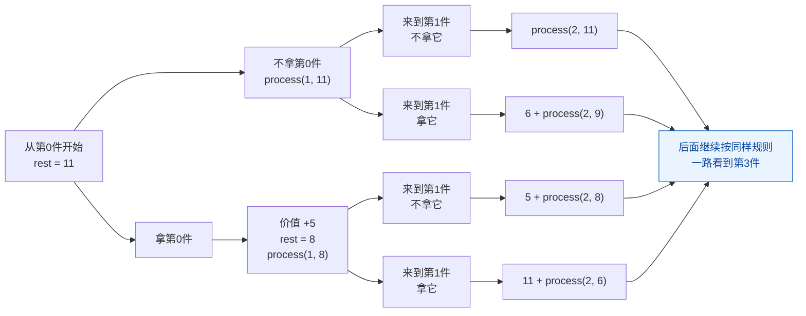
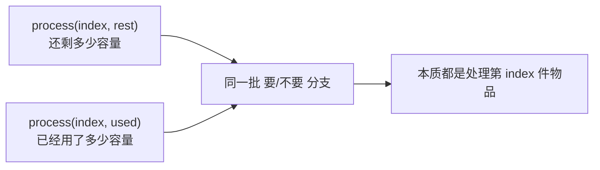
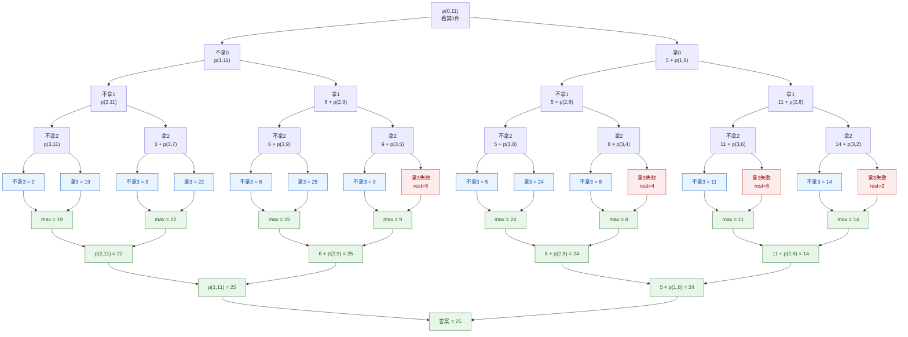

# 从左往右的尝试模型2-背包问题

[返回章节](README.md) | [返回分类](../README.md) | [返回总目录](../../README.md)

- 状态：已标记完成
- 所属分类：基础巩固
- 所属章节：12 暴力递归到动态规划1-递归尝试
- 原始条目：☒ 从左往右的尝试模型2（背包问题，2种思路）

## 一句话结论
0/1 背包是“从左往右尝试模型”的另一道标准题：来到第 `index` 件物品时，只做一个决策，拿它还是不拿它。  
这题最常见有两种递归状态设计：用“剩余容量 `rest`”描述当前局面，或者用“已用容量 `used`”描述当前局面；两者都能做，但后续改动态规划时，`rest` 版通常更顺手。

## 理论 / 应用价值

### 在知识体系中的位置

```text
暴力递归基础
  -> 先学会定义状态和分支
从左往右的尝试模型
  -> 每次只处理当前位置的选择
0/1 背包
  -> 当前物品要 / 不要
动态规划
  -> 状态压成 dp[index][rest]
```

### 为什么值得学

1. **它是“从左往右模型”的经典代表**
   - 数字转字母是“当前取 1 位还是 2 位”
   - 背包问题是“当前物品要还是不要”

2. **它能训练“状态设计”的能力**
   - 同一题可以用不同方式定义递归参数
   - 这正是后面做记忆化搜索和 DP 的基础

3. **它是后续动态规划的必经样板**
   - 暴力递归写清楚后，很容易改成二维 DP
   - 几乎所有入门 DP 课程都会用它当模板题

### 它解决的核心问题

- 给定容量限制，如何在“每件物品最多拿一次”的前提下取得最大价值
- 如何把“全局最优”拆成“当前物品的局部决策 + 后续最优子问题”
- 如何区分“求最大值”和“求方案数”这两类递归目标

### 与相邻题型的关系

- 和数字转字母一样，都是沿着输入从左往右推进
- 和全排列不同，这题不会打乱顺序，只在每个位置做二选一
- 和后续“背包问题改动态规划”完全对应，递归状态基本可以直接搬成 DP 表
- 和完全背包不同，本题每件物品只能选 `0` 次或 `1` 次

## 核心知识点
- 题型本质：标准 `0/1` 背包，每件物品最多选一次
- 状态核心：当前位置 `index`
- 分支核心：不要当前物品 / 要当前物品
- 常见状态设计：
  - `process(index, rest)`：还剩多少容量
  - `process(index, used)`：已经用了多少容量
- 目标函数：在合法前提下求最大总价值

## 图片转写 / 题意还原
这题整理成标准题意，就是：

- 有 `N` 件物品
- `weights[i]` 表示第 `i` 件物品的重量
- `values[i]` 表示第 `i` 件物品的价值
- 给定一个背包容量上限 `bag`
- 每件物品最多只能拿一次，不能重复拿，也不能拆分
- 要求在总重量不超过 `bag` 的前提下，让总价值尽可能大

**输入**：
- 等长数组 `weights`
- 等长数组 `values`
- 一个正整数 `bag`

**输出**：
- 一个整数，表示可取得的最大总价值

**规则 / 边界**：
- `weights.length == values.length`
- 每件物品只有“拿 / 不拿”两种状态
- 总重量不能超过 `bag`
- 如果某件物品太重，当前这条“拿它”的分支就是非法分支

**示例**：

```text
weights = [3, 2, 4, 7]
values  = [5, 6, 3, 19]
bag = 11

最优选择:
不拿第0件，拿第1件和第3件
总重量 = 2 + 7 = 9
总价值 = 6 + 19 = 25

答案 = 25
```

## 图解

### 决策树长什么样

以：

```text
weights = [3, 2, 4, 7]
values  = [5, 6, 3, 19]
bag = 11
```

为例，只把前两层画出来：



**读图抓手**：
- 每来到一件物品，只决策一次：要还是不要。
- “拿”会同时带来两个变化：价值增加、`rest` 减少。
- 后面的第 `2`、`3`、`4` 件物品，仍然完全按同样规则继续展开。
- 所以这题的关键不是背树，而是看懂“每一层都只做当前物品的要 / 不要决策”。

### 两种状态定义其实在看同一棵树



**关键观察**：
- 两种写法看到的是同一棵决策树，只是描述当前局面的语言不同。
- `rest` 版更像“还能装多少”，转移时更自然。
- 后面改 DP 时，通常也更容易直接写成 `dp[index][rest]`。

## 解题思路

### 为什么这么做
这题要在所有合法拿法里找最大价值，但每件物品最多只选一次，所以很自然地可以按物品顺序考虑：

- 来到第 `index` 件物品
- 决定拿还是不拿
- 剩下问题交给后面的物品去解决

这正是典型的“从左往右尝试模型”。

### 怎么做：思路一，用剩余容量 `rest`

定义：

```text
process(index, rest)
```

含义：

- 从 `index` 开始往后自由选择
- 当前背包还剩 `rest` 容量
- 返回能够得到的最大价值

分类讨论：

1. **如果 `rest < 0`**
   - 说明前面的选择超重了
   - 这条路非法，返回 `-1`

2. **如果 `index == N`**
   - 没有物品可选了
   - 返回 `0`

3. **不要当前物品**
   - `p1 = process(index + 1, rest)`

4. **要当前物品**
   - 先递归看 `process(index + 1, rest - weights[index])`
   - 如果子过程不是非法值 `-1`
   - 则 `p2 = values[index] + next`

5. **取最大值**
   - `ans = max(p1, p2)`

### 怎么做：思路二，用已用容量 `used`

定义：

```text
process(index, used)
```

含义：

- 从 `index` 开始往后自由选择
- 当前已经用了 `used` 容量
- 返回还能得到的最大价值

分类讨论和前面几乎一样：

1. 如果 `used > bag`，说明超重，返回 `-1`
2. 如果 `index == N`，返回 `0`
3. 不拿当前物品：`p1 = process(index + 1, used)`
4. 拿当前物品：尝试 `process(index + 1, used + weights[index])`
5. 仍然取 `max(p1, p2)`

### 两种思路怎么选

- 如果你想让“约束条件”表达得更直接，`used` 版也完全可以写
- 如果你准备继续改动态规划，`rest` 版通常更自然
- 因为 `rest` 版的转移就是：

```text
当前答案 = max(不要, 要了之后去看 rest - weight)
```

这个形式和二维 DP 表几乎一一对应

### 为什么对
因为任意一个合法最优解，对第 `index` 件物品来说只能属于下面两类之一：

- 不选它
- 选它

两种情况互斥，而且合起来完整覆盖所有可能决策，所以只要分别求出这两类情况下的最优值，再取最大值，就是当前位置的最优答案。

## 复杂度
- **时间复杂度**：`O(2^N)`
  - 每件物品都可能分成“拿 / 不拿”两条路
- **空间复杂度**：`O(N)`
  - 主要来自递归深度

## 典型例子

以：

```text
weights = [3, 2, 4, 7]
values  = [5, 6, 3, 19]
bag = 11
```

为例，用 `process(index, rest)` 来看，完整流程可以画成下面这张图：



读这张图时，重点抓住 3 件事：

- 每一层只处理当前这一个 `index` 的物品
- 每个节点都只有两种尝试：拿 / 不拿
- 走到第3件时，已经来到最后一层，所以这一层之后就是最直接的返回结果
- 这张图是完整展开版，因此你可以从根一路顺着看到叶子，再一路看回 `max`

最终最优值是：

```text
25
```

对应选择：

- 不拿第0件
- 拿第1件
- 不拿第2件
- 拿第3件

## 易错点
- 这题是 `0/1` 背包，不是完全背包，同一件物品不能重复拿
- 递归函数返回的是“最大价值”，不是“是否能装满”
- `rest < 0` 或 `used > bag` 时，应该把这条路视为非法分支
- 非法分支不能直接返回 `0`，否则会把“超重路线”误当成合法答案
- `index == N` 时返回 `0`，表示后面没有价值可拿了
- `weights` 和 `values` 必须等长，否则题目本身就不成立

## 代码 / 伪代码

### 写法一：剩余容量版

```java
int maxValue(int[] w, int[] v, int bag) {
    if (w == null || v == null || w.length != v.length || bag < 0) {
        return 0;
    }
    return process(w, v, 0, bag);
}

int process(int[] w, int[] v, int index, int rest) {
    if (rest < 0) {
        return -1;
    }
    if (index == w.length) {
        return 0;
    }

    int p1 = process(w, v, index + 1, rest);

    int p2 = -1;
    int next = process(w, v, index + 1, rest - w[index]);
    if (next != -1) {
        p2 = v[index] + next;
    }

    return Math.max(p1, p2);
}
```

### 写法二：已用容量版

```java
int process2(int[] w, int[] v, int index, int used, int bag) {
    if (used > bag) {
        return -1;
    }
    if (index == w.length) {
        return 0;
    }

    int p1 = process2(w, v, index + 1, used, bag);

    int p2 = -1;
    int next = process2(w, v, index + 1, used + w[index], bag);
    if (next != -1) {
        p2 = v[index] + next;
    }

    return Math.max(p1, p2);
}
```

## 记忆点
- 背包题是“从左往右模型”里最经典的“要 / 不要”决策树。
- 同一题可以用 `index + rest` 或 `index + used` 建模。
- 非法分支要返回“非法标记”，不能装作 `0`。
- 后续改动态规划时，优先记住 `process(index, rest)` 这套定义。
