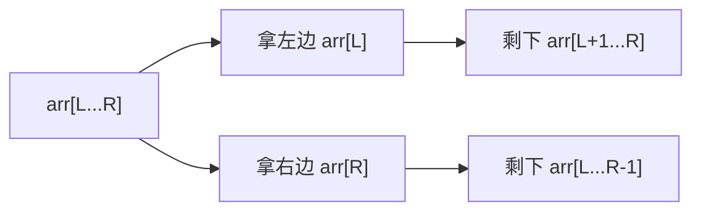
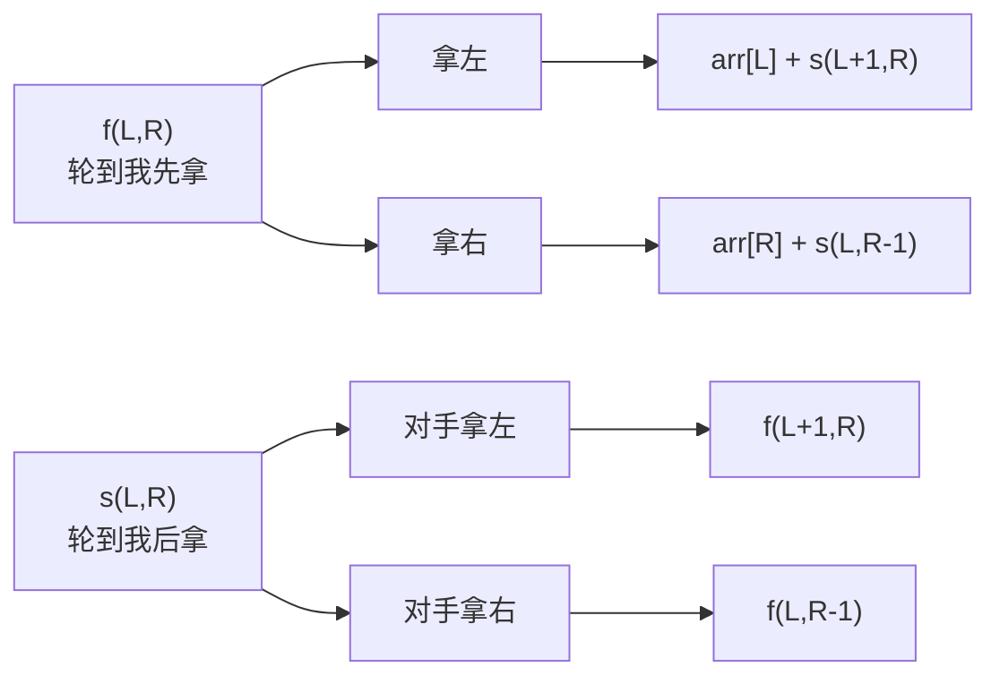
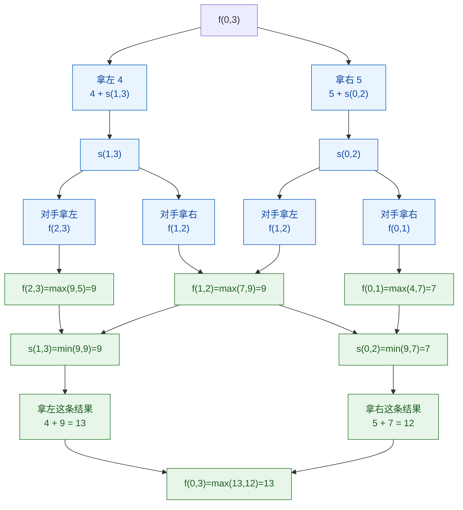

# 从范围上的尝试模型-纸牌博弈

[返回章节](README.md) | [返回分类](../README.md) | [返回总目录](../../README.md)

- 状态：已标记完成
- 所属分类：基础巩固
- 所属章节：13 暴力递归到动态规划2-尝试模型
- 原始条目：☒ 范围上的尝试模型

## 一句话结论
范围模型和“从左往右模型”最大的区别在于：

```text
递归状态不再是某个单点位置
而是当前还剩下哪一段区间 [L, R]
```

纸牌博弈是这个模型最经典的代表题，因为每一步都只能从区间两端拿牌，所以状态天然就是一个范围。  
而且这题还有一个特别重要的点：

```text
同一个区间
轮到先手和轮到后手
含义完全不同
```

所以通常要设计两个函数，而不是一个函数硬糊过去。

## 理论 / 应用价值
这篇最值得学的，不只是纸牌博弈本身，而是“范围模型”这种思考方式。

它在整套知识体系里的位置可以这样理解：

```text
暴力递归基础
-> 学会定义状态和分支
从左往右模型
-> 状态通常是单个位置
范围模型
-> 状态变成区间 [L, R]
区间动态规划
-> 状态表通常也是 [L][R]
```

为什么这题特别重要：

1. 它是范围模型的标准样板。
2. 它会逼你把“先手”和“后手”的角色彻底分开。
3. 它和后面的区间 DP 几乎是一一对应的。

这篇真正训练的是：

- 什么时候状态该定义成 `[L, R]`
- 为什么博弈题有时必须拆成两个函数
- 为什么“我想怎么拿”和“对手会让我落到什么局面”是两种完全不同的递归含义

## 核心知识点
- 状态核心：当前只剩区间 `[L, R]`
- 决策核心：当前只能拿左端 `arr[L]` 或右端 `arr[R]`
- 角色核心：
  - `f(L, R)`：当前轮到先手，在 `[L, R]` 上最终能拿到的最好分数
  - `s(L, R)`：当前轮到后手，在 `[L, R]` 上最终能拿到的最好分数
- 先手取 `max`
- 后手取 `min`

## 图片转写 / 题意还原
这题整理成标准描述，就是：

- 给定一个整型数组 `arr`，每个元素表示一张纸牌上的分数
- 一排纸牌排成一行
- 两个玩家轮流拿牌，A 先手，B 后手
- 每次只能从最左端或最右端拿走一张
- 两个玩家都绝顶聪明，都会做让自己最终得分最优的选择
- 当所有牌都拿完后，比较双方总分
- 返回最终获胜者的分数

**输入**：
- 一个整型数组 `arr`

**输出**：
- 一个整数，表示获胜者的最终分数

**规则 / 边界**：
- 只能拿最左或最右，不能拿中间
- 两个人轮流行动，A 永远先手
- 双方都按最优策略行动，不会犯低级错误
- 如果区间只剩一张牌，当前先手直接拿走它，后手得分为 `0`

**示例**：

```text
arr = [1, 100, 2]

A 如果拿左边 1：
  剩下 [100, 2] 给 B 先手
  B 会拿 100
  A 最终最多只能拿到 1 + 2 = 3

A 如果拿右边 2：
  剩下 [1, 100] 给 B 先手
  B 会拿 100
  A 最终最多只能拿到 2 + 1 = 3

所以赢家分数是 100
```

## 图解

### 为什么状态是区间 `[L, R]`



**读图抓手**：
- 这题不是“来到哪个位置”，而是“当前还剩哪一段”。
- 每做一次决策，规模缩小的方式不是 `index + 1`，而是区间左右边界收缩。
- 所以 `[L, R]` 才是最自然的状态。

### 为什么一定要拆成 `f` 和 `s`



**关键观察**：
- `f(L, R)` 里，做决定的是我，所以我要选更大的那条路。
- `s(L, R)` 里，做决定的是对手，所以他会把我送进更差的那条路。
- 这就是为什么 `f` 取 `max`，`s` 取 `min`。

## 解题思路

### 为什么这么做
这题最容易写乱的地方就在于：

```text
同样是区间 [L, R]
轮到先手和轮到后手
根本不是同一个问题
```

所以最自然的做法不是只写一个递归，而是明确拆开：

- `f(L, R)`：如果现在轮到我先拿，我最多能拿多少
- `s(L, R)`：如果现在轮到我后拿，我最后最多能拿多少

这样每个函数的职责都会清晰很多。

### 怎么做

定义：

```text
f(L, R) = 当前轮到先手，在 arr[L...R] 上最终能拿到的最好分数
s(L, R) = 当前轮到后手，在 arr[L...R] 上最终能拿到的最好分数
```

#### 1. 先手函数 `f(L, R)`

先手有两种选择：

- 拿左边：得到 `arr[L]`，之后自己会变成后手，面对 `[L+1, R]`
- 拿右边：得到 `arr[R]`，之后自己会变成后手，面对 `[L, R-1]`

所以：

```text
f(L, R) = max(
    arr[L] + s(L + 1, R),
    arr[R] + s(L, R - 1)
)
```

#### 2. 后手函数 `s(L, R)`

后手当前不能主动选牌，因为这一步是对手在拿。

对手拿完之后，会把你留在下面两个局面之一：

- 对手拿左边，留给你 `f(L+1, R)`
- 对手拿右边，留给你 `f(L, R-1)`

由于对手也最优，他会故意让你进入更差的局面，所以：

```text
s(L, R) = min(
    f(L + 1, R),
    f(L, R - 1)
)
```

#### 3. base case

如果只剩一张牌，也就是 `L == R`：

- 先手直接拿走它：`f(L, R) = arr[L]`
- 后手什么也拿不到：`s(L, R) = 0`

#### 4. 最终答案

整场游戏一开始，A 是先手，所以：

```text
先手分数 = f(0, N - 1)
后手分数 = s(0, N - 1)
答案 = max(f(0, N - 1), s(0, N - 1))
```

### 为什么对
因为对任意区间 `[L, R]` 来说，当前局面只可能是下面两种角色之一：

- 当前轮到先手
- 当前轮到后手

而每种角色下，后继局面也只可能是：

- 左端被拿掉
- 右端被拿掉

于是：

- `f` 完整枚举了先手的所有合法选择
- `s` 完整枚举了对手会把你送去的所有局面

两者合起来，正好完整覆盖整个博弈过程。

## 典型例子

以：

```text
arr = [4, 7, 9, 5]
```

为例。

### 先看整个区间 `[0, 3]`

```text
f(0, 3)
= max(
    4 + s(1, 3),
    5 + s(0, 2)
)
```

意思是：

- 如果先手拿左边 `4`，后面能拿多少，取决于 `s(1, 3)`
- 如果先手拿右边 `5`，后面能拿多少，取决于 `s(0, 2)`

### 用图看这棵区间递归树



读这张图时，重点抓住：

- `f` 节点是“我做选择”，所以往下看完以后要取 `max`
- `s` 节点是“对手做选择”，所以往下看完以后要取 `min`
- 区间每次都会收缩成 `[L+1, R]` 或 `[L, R-1]`

### 再看最小区间

如果只剩一张牌：

```text
f(2,2) = 9
s(2,2) = 0

f(3,3) = 5
s(3,3) = 0
```

这就是整棵递归树最底层不断返回的基础。

### 最终结论

完整算完后：

```text
f(0,3) = 13
s(0,3) = 12
答案 = 13
```

对应的一条最优理解是：

- A 先拿左边 `4`
- 不管 B 后面怎么最优应对
- A 都还能保证把 `9` 这张高分牌拿到
- 所以 A 最终可以保证自己拿到 `13`

## 复杂度
- **时间复杂度**：暴力递归约为 `O(2^N)`
  - 大量区间状态会被重复计算
- **空间复杂度**：`O(N)`
  - 主要来自递归深度

## 易错点
- 不要把这题写成只用一个函数，先手和后手的含义不同。
- `s(L, R)` 不是“后手主动取最小值”，而是“对手会让我落到更差局面，所以我最终只能得到较小结果”。
- `L == R` 时，`f(L, R) = arr[L]`，`s(L, R) = 0`。
- 返回值是“最终获胜者分数”，不是“先手是否必胜”。
- 这题不能贪心地只拿大的一端，因为对手下一步也会最优反击。

## 代码 / 伪代码

```java
int win(int[] arr) {
    if (arr == null || arr.length == 0) {
        return 0;
    }
    int first = f(arr, 0, arr.length - 1);
    int second = s(arr, 0, arr.length - 1);
    return Math.max(first, second);
}

int f(int[] arr, int L, int R) {
    if (L == R) {
        return arr[L];
    }
    return Math.max(
        arr[L] + s(arr, L + 1, R),
        arr[R] + s(arr, L, R - 1)
    );
}

int s(int[] arr, int L, int R) {
    if (L == R) {
        return 0;
    }
    return Math.min(
        f(arr, L + 1, R),
        f(arr, L, R - 1)
    );
}
```

如果把这段代码翻成最短话术，就是：

```text
先手：左右都试，取更大
后手：对手会压我，取更小
```

## 记忆点
- 范围模型先看状态是不是一个区间 `[L, R]`。
- 纸牌博弈要分清“当前先手”和“当前后手”两个角色。
- `f` 取 `max`，`s` 取 `min`。
- 后续改动态规划时，通常就是两张二维表：`fdp[L][R]` 和 `sdp[L][R]`。
