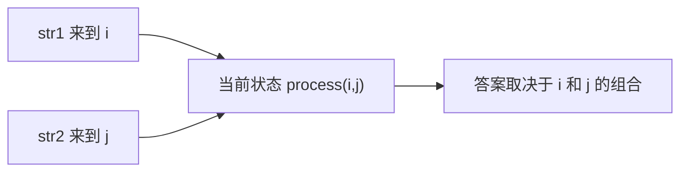
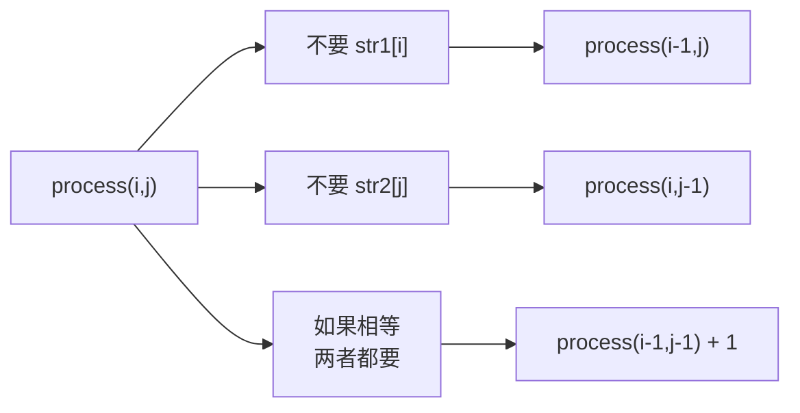
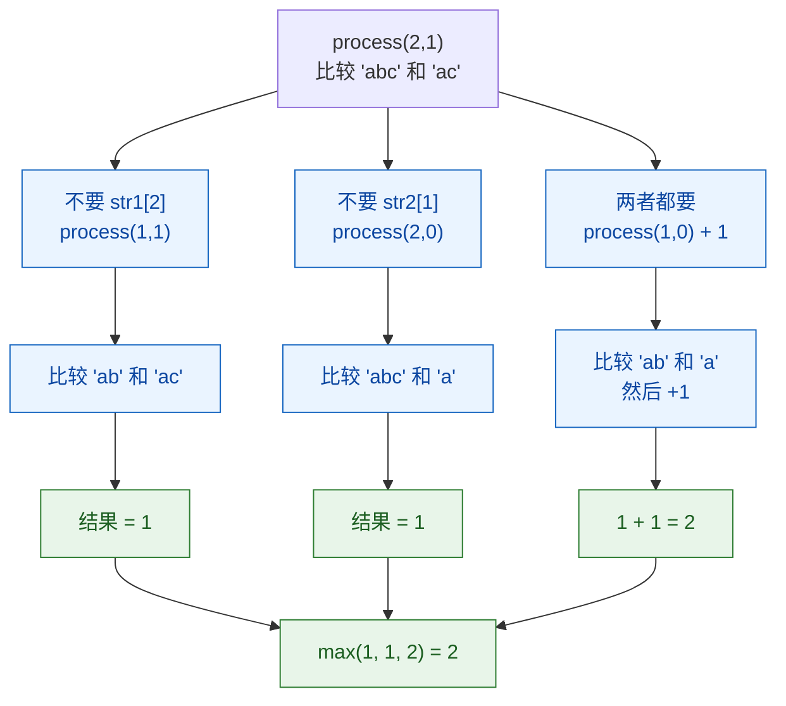

# 多样本位置全对应的尝试模型-最长公共子序列

[返回章节](README.md) | [返回分类](../README.md) | [返回总目录](../../README.md)

- 状态：已标记完成
- 所属分类：基础巩固
- 所属章节：13 暴力递归到动态规划2-尝试模型
- 原始条目：☒ 多样本位置全对应的尝试模型

## 一句话结论
最长公共子序列是“多样本位置全对应模型”的标准代表题。

这类题的核心不是只看一个位置，而是：

```text
多个样本各自走到哪里
共同决定当前状态
```

所以状态天然会带多个下标，比如：

```text
process(i, j)
```

表示两个字符串各自来到 `i` 和 `j` 时，当前问题的答案是多少。

## 理论 / 应用价值
这篇最重要的不是 LCS 本身，而是要建立一种识别模型的能力：

```text
当题目里有多个样本
而且每个样本都要同步推进时
状态往往要带多个位置参数
```

它在整套知识体系里的位置可以这样理解：

```text
暴力递归方法论
-> 识别常见尝试模型
从左往右模型
-> 单样本单位置
范围模型
-> 单样本区间 [L, R]
多样本位置全对应
-> 多个样本各自一个位置
动态规划
-> 状态表往往是二维甚至更高维
```

为什么这题值得学：

1. 它是“双样本递归”最经典的入门题。
2. 它和二维 DP 的对应关系非常直接。
3. 它能训练你区分“子序列”和“子串”这两种完全不同的问题。

这篇真正训练的是：

- 什么时候状态该同时带两个位置
- 为什么最后一个字符的关系能决定当前分支
- 为什么这类题改动态规划时，通常就是一个二维表

## 核心知识点
- 目标是求最长公共子序列长度，不是必须输出序列本身
- 状态常写成：
  - `process(i, j)`：`str1[0..i]` 与 `str2[0..j]` 的 LCS 长度
- 当前答案由 `i` 和 `j` 共同决定
- 如果 `str1[i] == str2[j]`，可以考虑把这两个字符一起要掉
- 如果不相等，至少有一边的最后字符不能要

## 图片转写 / 题意还原
这题的标准描述是：

- 给定两个字符串 `str1` 和 `str2`
- 可以分别从两个字符串中删除若干字符，也可以一个都不删
- 删除后保留字符的相对顺序不能改变
- 如果两个字符串都能变成同一个字符串，那么这个字符串就是它们的公共子序列
- 问最长公共子序列的长度是多少

**输入**：
- 两个字符串 `str1`、`str2`

**输出**：
- 一个整数，表示最长公共子序列长度

**注意**：
- 这是“子序列”，不是“子串”
- 子序列可以不连续，但相对顺序必须一致

**示例**：

```text
str1 = "abcde"
str2 = "ace"

最长公共子序列是 "ace"
答案 = 3
```

## 图解

### 为什么状态一定要带两个位置



**读图抓手**：
- 只知道 `i` 不够，因为还要看 `str2` 当前来到哪里。
- 只知道 `j` 也不够，因为还要看 `str1` 当前来到哪里。
- 所以这类题天然是“多样本位置全对应”模型。

### 为什么围绕最后字符来讨论



**关键观察**：
- 当前问题只看两个前缀：`str1[0..i]` 和 `str2[0..j]`
- 所以最后一个字符 `str1[i]`、`str2[j]` 必然是当前讨论焦点
- 如果它们不相等，不可能同时作为公共子序列结尾
- 如果它们相等，才有“左上角 + 1”这种最关键的转移

## 解题思路

### 为什么这么做
LCS 最容易绕晕的地方就在于：

```text
两个字符串都在动
当前答案不是由一个位置决定
而是由两个位置共同决定
```

所以最自然的定义就是：

```text
process(i, j)
```

表示：

- `str1[0..i]`
- `str2[0..j]`

这两段前缀的最长公共子序列长度。

### 怎么做

#### base case

当某一边已经只剩一个字符时，要单独判断：

- 如果 `i == 0`
  - 看 `str1[0]` 是否在 `str2[0..j]` 里出现
- 如果 `j == 0`
  - 看 `str2[0]` 是否在 `str1[0..i]` 里出现

这一步的本质是：

```text
只要单个字符能在另一边前缀里找到
LCS 长度就是 1
否则就是 0
```

#### 一般情况

看 `str1[i]` 和 `str2[j]`。

1. **不要 `str1[i]`**

```text
process(i - 1, j)
```

2. **不要 `str2[j]`**

```text
process(i, j - 1)
```

3. **如果 `str1[i] == str2[j]`，两者都要**

```text
process(i - 1, j - 1) + 1
```

最后取最大值。

### 为什么对
因为对 `str1[0..i]` 和 `str2[0..j]` 的最优答案来说，最后位置只可能属于下面几种情况：

- 最优答案不使用 `str1[i]`
- 最优答案不使用 `str2[j]`
- 如果 `str1[i] == str2[j]`，最优答案也可能同时使用它们

这些情况合起来完整覆盖了所有可能，所以递归定义是完备的。

## 典型例子

以：

```text
str1 = "abc"
str2 = "ac"
```

为例。

### 先看最终状态

```text
process(2, 1)
```

也就是比较：

- `str1[0..2] = "abc"`
- `str2[0..1] = "ac"`

因为：

- `str1[2] = 'c'`
- `str2[1] = 'c'`

它们相等，所以“都要”这条分支会特别关键。

### 用图看这棵小递归树



读这张图时，重点抓住：

- 当最后字符相等时，最重要的往往是“左上角 + 1”
- 但另外两条“不要一边”的分支仍然要保留，不能直接删掉
- 因为递归求的是“最大值”，不是只认相等就一定答案来自对角线

### 再看一个关键子问题

```text
process(1, 0)
```

表示比较：

- `"ab"`
- `"a"`

这里只有一个字符可供第二个字符串使用，所以答案显然是：

```text
1
```

于是：

```text
process(2, 1)
= process(1, 0) + 1
= 2
```

最终答案就是：

```text
2
```

对应的最长公共子序列是：

```text
"ac"
```

## 复杂度
- 纯暴力递归时间复杂度：指数级
- 空间复杂度：递归栈约 `O(N + M)`
- 这题非常适合改成二维 DP

## 易错点
- 子序列不是子串，不要求连续。
- 状态不是一个位置，而是两个位置。
- 相等时才有“左上角 + 1”。
- 不相等时不是简单地都减一，而是要分别尝试去掉一边。
- “相等就一定选对角线”这句话不严谨，正确说法是：相等时对角线是一条必须考虑的重要分支。

## 代码 / 伪代码

```java
int lcs(char[] str1, char[] str2, int i, int j) {
    if (i == 0 && j == 0) {
        return str1[0] == str2[0] ? 1 : 0;
    }
    if (i == 0) {
        if (str1[0] == str2[j]) {
            return 1;
        }
        return lcs(str1, str2, 0, j - 1);
    }
    if (j == 0) {
        if (str1[i] == str2[0]) {
            return 1;
        }
        return lcs(str1, str2, i - 1, 0);
    }

    int p1 = lcs(str1, str2, i - 1, j);
    int p2 = lcs(str1, str2, i, j - 1);
    int p3 = 0;
    if (str1[i] == str2[j]) {
        p3 = lcs(str1, str2, i - 1, j - 1) + 1;
    }
    return Math.max(p1, Math.max(p2, p3));
}
```

把这段代码翻成最短话术，就是：

```text
两个位置一起定义状态
不相等看左和上
相等时再看左上角加一
```

## 记忆点
- 多样本位置全对应，核心就是多个位置参数一起定义状态。
- LCS 是这类模型最标准的代表题。
- 相等看左上角加一，不等看上边和左边。
- 后续改动态规划时，通常就是一个二维表 `dp[i][j]`。
