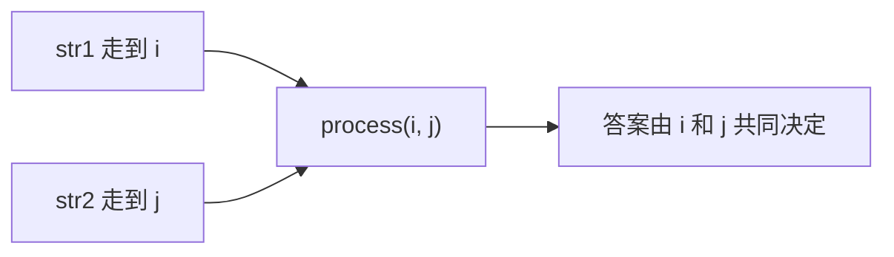
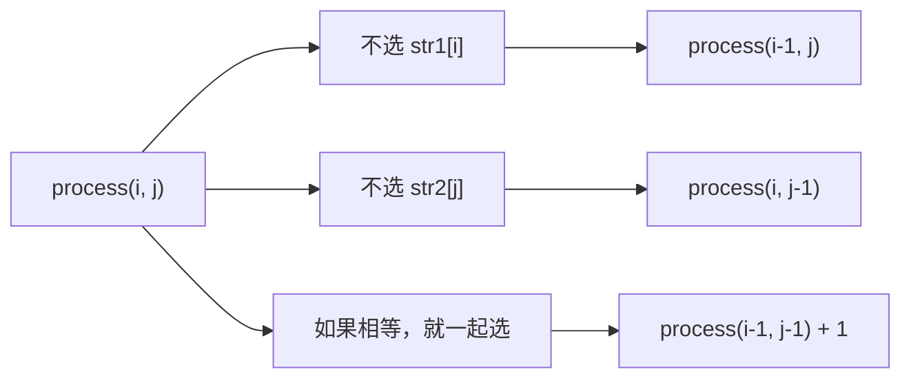
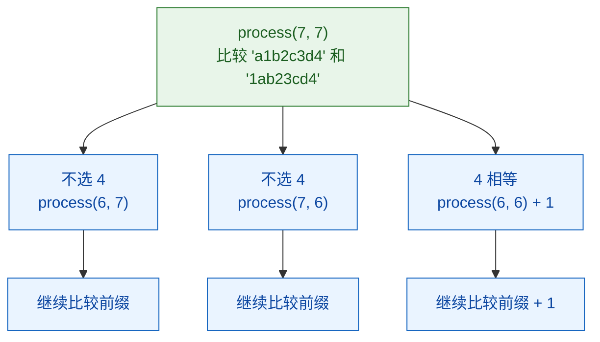

# 多样本位置全对应的尝试模型：最长公共子序列

[返回章节](README.md) | [返回分类](../README.md) | [返回总目录](../../README.md)

- 状态：已标记完成
- 所属分类：基础巩固
- 所属章节：13 暴力递归到动态规划2-尝试模型
- 原始条目：☒ 多样本位置全对应的尝试模型

## 题目
给定两个字符串 `str1` 和 `str2`，删除其中若干字符后，要求剩下的字符顺序不变。

问题是：两边都可以删，最后能得到的“最长公共子序列”有多长。

注意这里说的是“子序列”，不是“子串”。

## 一句话结论
LCS 的本质是：两个样本一起往前走，状态必须同时带上两个位置。  
如果末尾字符相等，就考虑一起选；如果不相等，就分别尝试丢掉一边，取最大值。

## 理论 / 应用价值
- 这是“多样本位置全对应”模型的标准代表题。
- 它最核心的训练点，不是背公式，而是学会把两个序列的当前位置一起作为状态。
- 这类题一旦会了，后面很多字符串 DP、编辑类 DP 都能顺着迁移。

## 核心知识点
- 状态一般写成 `process(i, j)`
- `i` 和 `j` 分别表示两个字符串当前考虑到的位置
- `str1[i] == str2[j]` 时，可以考虑让这两个字符一起进入答案
- 不相等时，至少要有一边把最后字符舍弃
- 最终通常会改写成二维 DP

## 图片转写 / 题意还原
原题意思可以整理成下面这样：

- 给定两个字符串 `str1` 和 `str2`
- 每个字符串都可以删除若干字符，也可以一个都不删
- 删除后字符的相对顺序不能改变
- 如果两边最终都能变成同一个字符串，这个字符串就是它们的公共子序列
- 问最长公共子序列的长度

举个更典型的例子：

```text
str1 = "a1b2c3d4"
str2 = "1ab23cd4"
```

这两个字符串不是简单对齐的，公共子序列也不是一眼就能看出来，比较适合拿来体会“多样本位置一起决定状态”。

## 图解
### 先看状态为什么要带两个位置


只看 `i` 不够，因为还不知道 `str2` 走到哪。  
只看 `j` 也不够，因为还不知道 `str1` 走到哪。  
所以这类题天然就是“双位置共同定状态”。

### 再看最后一个字符怎么参与决策


这张图的关键不是“分支多”，而是先抓住一句话：  
`process(i, j)` 只看两个前缀的答案，最后一个字符一定要么被舍弃，要么被纳入答案。

## 解题思路
### 为什么这么定义
LCS 最容易绕晕的地方是：  
当前答案不是由一个位置决定，而是由两个位置共同决定。

所以自然定义成：

```text
process(i, j)
```

表示：

- `str1[0..i]`
- `str2[0..j]`

这两段前缀的最长公共子序列长度。

### base case
当某一边只剩一个字符时，就不能再继续“无限往左递归”了，需要单独判断：

- `i == 0`
- `j == 0`

本质上就是看这一侧的唯一字符，能不能在另一侧前缀里找到。

### 一般情况
1. 不选 `str1[i]`，看 `process(i - 1, j)`
2. 不选 `str2[j]`，看 `process(i, j - 1)`
3. 如果 `str1[i] == str2[j]`，再看 `process(i - 1, j - 1) + 1`

最后取最大值。

## 典型例子
```text
str1 = "a1b2c3d4"
str2 = "1ab23cd4"
```

先看最后一位：

- `str1[7] = '4'`
- `str2[7] = '4'`

相等，所以“两个都要”这一分支一定要保留。

再往前看：

- `str1[6] = 'd'`
- `str2[6] = 'd'`

还是相等。

继续往前：

- `str1[5] = '3'`
- `str2[5] = 'c'`

这时开始分叉：

- 可以舍弃 `str1[5]`
- 也可以舍弃 `str2[5]`
- 如果两边当前位置相等，还可以走“同时选中”分支

这个例子比较典型的地方在于：  
它不是一条直线匹配，而是中间会不断出现“相等 / 不相等”交替，正好能看清楚 LCS 的递归结构。

### 小树形示意


## 为什么对
对 `process(i, j)` 来说，最后一个字符的归属只有三种可能：

- 不用 `str1[i]`
- 不用 `str2[j]`
- 两者相等时，一起用

这三种情况已经覆盖了所有可能，所以递归定义是完整的。

## 复杂度
- 时间复杂度：指数级
- 空间复杂度：递归栈 `O(N + M)`

## 代码 / 伪代码
```java
int lcs(char[] str1, char[] str2, int i, int j) {
    if (i == 0 && j == 0) {
        return str1[0] == str2[0] ? 1 : 0;
    }
    if (i == 0) {
        if (str1[0] == str2[j]) {
            return 1;
        }
        return lcs(str1, str2, 0, j - 1);
    }
    if (j == 0) {
        if (str1[i] == str2[0]) {
            return 1;
        }
        return lcs(str1, str2, i - 1, 0);
    }

    int p1 = lcs(str1, str2, i - 1, j);
    int p2 = lcs(str1, str2, i, j - 1);
    int p3 = 0;
    if (str1[i] == str2[j]) {
        p3 = lcs(str1, str2, i - 1, j - 1) + 1;
    }
    return Math.max(p1, Math.max(p2, p3));
}
```

把它翻成一句更短的话就是：

```text
不相等时，看左和上；
相等时，再多看左上 + 1。
```

## 易错点
- 子序列不是子串，不要求连续。
- 状态不是一个位置，而是两个位置。
- 相等时，左上角分支是必须考虑的。
- 不相等时不是简单减一，而是分别尝试两边。

## 记忆点
- LCS 是多样本位置全对应的标准题。
- 状态核心是 `process(i, j)`。
- 相等看左上加一，不相等看左和上。
- 这种题后面通常直接写成二维 `dp[i][j]`。
