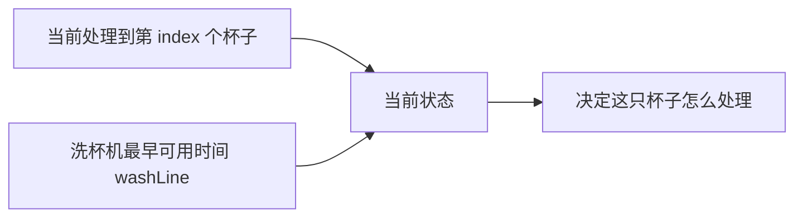
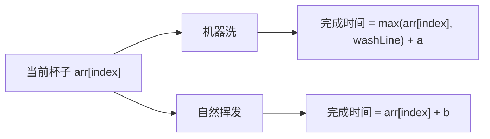
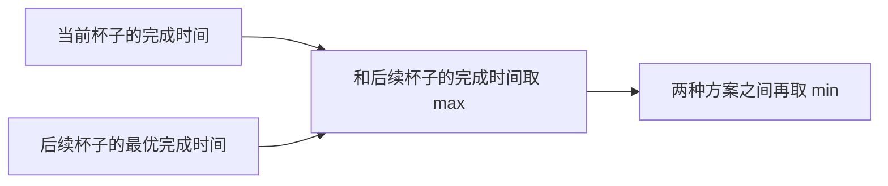

# 寻找业务限制的尝试模型：咖啡杯清洗问题

[返回章节](README.md) | [返回分类](../README.md) | [返回总目录](../../README.md)

- 状态：已标记完成
- 所属分类：基础巩固
- 所属章节：13 暴力递归到动态规划2-尝试模型
- 原始条目：☒ 寻找业务限制的尝试模型（咖啡杯清洗问题）

## 题目
给定一个数组 `arr`，其中 `arr[i]` 表示第 `i` 个人喝完咖啡、把杯子放到待处理区的时间。

现在有两种办法让杯子变干净：

- 用洗杯机洗：一次只能洗一个杯子，洗一只需要 `a` 时间
- 自然挥发：每只杯子都可以自己挥发干净，耗时 `b`，并且彼此互不影响

问题是：怎样安排每只杯子是“机器洗”还是“自然挥发”，才能让所有杯子都变干净的时间尽量早。

输入是：

- `int[] arr`
- `int a`
- `int b`

输出是：

- 一个整数，表示所有杯子都干净的最早时间

## 一句话结论
这题最关键的不是杯子编号，而是洗杯机什么时候空出来。  
所以状态不能只写 `index`，必须把这个真正的业务限制 `washLine` 一起带上。

## 理论 / 应用价值
这题是“寻找业务限制”模型里最典型的一题。

前面几类尝试模型里，状态往往比较直接：

- 从左往右：看位置
- 范围模型：看区间
- 多样本位置对应：看多个位置

但这题不一样。  
题目表面给你的只是“第几个杯子”，真正卡住后续决策的，却是洗杯机的可用时间。

所以它训练的不是单纯写递归，而是两件更重要的事：

1. 从题目业务里找出真正限制后续决策的量
2. 把这个量设计成状态参数

这也是为什么这题特别值得学。很多真实题目难的地方，不是分支多，而是状态不在题面上直接写给你。

## 核心知识点
- 每只杯子都有两种选择：机器洗 / 自然挥发
- 当前状态不能只看 `index`
- 真正限制后续决策的是洗杯机最早可用时间 `washLine`
- 当前方案的完成时间，要和后续方案一起取 `max`
- 两种选择之间，再取 `min`

## 图片转写 / 题意还原
把题目再换一种更直白的说法：

- 杯子不是同时出现的，而是在 `arr[i]` 这个时刻之后，才可以开始处理
- 洗杯机是串行资源，谁先用、谁后用，会影响后面的安排
- 自然挥发是并行资源，一只杯子去挥发，不会占住别的杯子
- 我们求的不是总耗时之和，而是“最后一只杯子干净的时刻”尽量早

所以这题的本质不是“每只杯子各自选最优”，而是：

```text
当前这只杯子的选择
会不会影响后面所有杯子的机器排队
```

## 图解
### 这题真正卡住后续的是什么


只知道是第几只杯子还不够。  
同样是处理第 `index` 只杯子，如果洗杯机现在就空闲，和还要等很久才空闲，后面的最优答案会完全不同。

### 当前杯子的两种选择


### 为什么答案里既有 `max`，又有 `min`


读这张图时，重点抓住两层含义：

- 一条方案内部：当前杯子和后续杯子，最终完成时间取 `max`
- 两条方案之间：机器洗和自然挥发，最后取 `min`

## 解题思路
### 为什么这么做
这题最容易想错的地方，是把它看成“每个杯子独立做选择”。

其实不行。因为：

- 自然挥发不会占资源
- 机器洗会占住唯一的洗杯机

所以当前杯子如果选了机器洗，就会直接改写后面杯子的排队起点。  
也就是说，真正的状态不只是“处理到哪只杯子”，还要加上：

```text
洗杯机下一次最早什么时候能用
```

这个量就是 `washLine`。

### 怎么定义状态
定义：

```text
process(index, washLine)
```

表示：

- 从第 `index` 只杯子开始处理
- 当前洗杯机最早可用时间是 `washLine`
- 返回后续所有杯子都变干净的最早完成时间

### base case
如果已经来到最后一只杯子，那么它只有两种选择：

1. 机器洗

```text
wash = max(arr[index], washLine) + a
```

2. 自然挥发

```text
dry = arr[index] + b
```

这时直接取较小值：

```text
min(wash, dry)
```

### 一般情况
当前杯子仍然是两种选择。

#### 选择 1：机器洗
先算这只杯子什么时候洗完：

```text
wash = max(arr[index], washLine) + a
```

为什么要取 `max`？

- 杯子必须先等自己出现
- 洗杯机也必须先空出来

所以真正开始洗的时间，是这两者较晚的那个。

然后进入下一个状态：

```text
process(index + 1, wash)
```

因为机器已经被占到 `wash` 时刻了。

整条“机器洗”方案的最终完成时间是：

```text
max(wash, process(index + 1, wash))
```

#### 选择 2：自然挥发
这只杯子挥发完成时间：

```text
dry = arr[index] + b
```

因为它不占用洗杯机，所以后续状态还是：

```text
process(index + 1, washLine)
```

整条“自然挥发”方案的最终完成时间是：

```text
max(dry, process(index + 1, washLine))
```

#### 当前状态答案
最后在这两种方案中取更优的：

```text
min(p1, p2)
```

## 复杂度
- 时间复杂度：纯递归会很高，因为 `washLine` 会带来大量状态分支
- 空间复杂度：递归栈深度约为 `O(N)`

## 典型例子
```text
arr = [1, 3]
a = 2
b = 5
```

先看第 0 只杯子：

- 它最早在时间 `1` 出现
- 初始 `washLine = 0`

### 方案 1：第 0 只杯子机器洗

```text
wash = max(1, 0) + 2 = 3
```

说明第 0 只杯子在时间 `3` 洗完。  
这时后续状态变成：

```text
process(1, 3)
```

因为洗杯机要到时间 `3` 才重新可用。

### 方案 2：第 0 只杯子自然挥发

```text
dry = 1 + 5 = 6
```

这时后续状态是：

```text
process(1, 0)
```

因为自然挥发没有占洗杯机，后面的机器可用时间不变。

这里就能清楚看出 `washLine` 的作用：

- 同样是处理第 1 只杯子
- `process(1, 3)` 和 `process(1, 0)` 的后续答案可能完全不同

所以这题不能只写成 `process(index)`。

## 易错点
- 求的是“最后全部干净的最早时刻”，不是所有时间简单求和
- `washLine` 不是当前杯子的出现时间，而是洗杯机最早可用时间
- 机器洗的开始时刻要写成 `max(arr[index], washLine)`
- 一条方案内部先取 `max`，两条方案之间再取 `min`
- 这题最难的不是分支，而是识别出真正的业务限制状态

## 代码 / 伪代码
```java
int process(int[] arr, int a, int b, int index, int washLine) {
    if (index == arr.length - 1) {
        int p1 = Math.max(arr[index], washLine) + a;
        int p2 = arr[index] + b;
        return Math.min(p1, p2);
    }

    int wash = Math.max(arr[index], washLine) + a;
    int next1 = process(arr, a, b, index + 1, wash);
    int p1 = Math.max(wash, next1);

    int dry = arr[index] + b;
    int next2 = process(arr, a, b, index + 1, washLine);
    int p2 = Math.max(dry, next2);

    return Math.min(p1, p2);
}
```

第一次读这段代码时，可以先抓住这条主线：

```text
当前杯子有两种选择：
机器洗 or 自然挥发

每种方案内部：
当前完成时间 和 后续完成时间 取 max

两种方案之间：
最后取 min
```

## 记忆点
- 业务限制模型的关键，是先找出真正限制后续决策的量
- 咖啡杯清洗问题里，这个量就是 `washLine`
- 当前状态答案：方案内取 `max`，方案间取 `min`
- 这题不是位置模型，难点在状态设计
