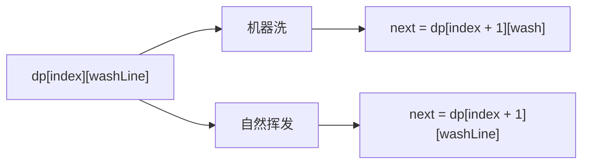
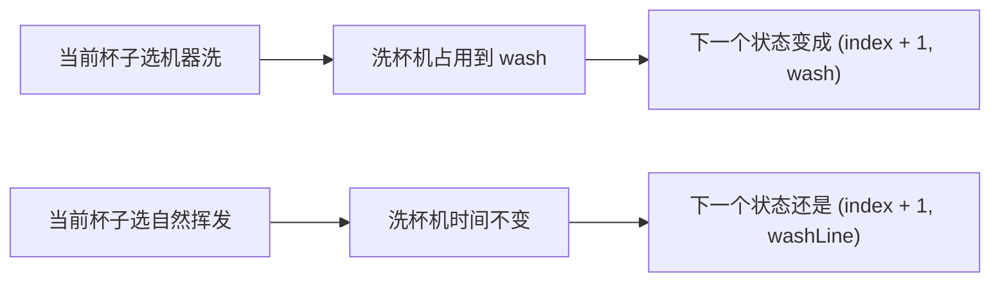

# 17-改动态规划-咖啡杯清洗问题

[返回章节](README.md) | [返回分类](../README.md) | [返回总目录](../../README.md)

- 状态：已标记完成
- 所属分类：基础巩固
- 所属章节：14 暴力递归到动态规划2-暴力递归改动态规划
- 原始条目：咖啡杯清洗问题-从递归到动态规划

## 题目
给定一个数组 `arr`，其中 `arr[i]` 表示第 `i` 个人喝完咖啡、把杯子放到待处理区的时间。

每只杯子有两种变干净的方式：

- 用洗杯机洗：一次只能洗一只，洗一只需要 `a` 时间
- 自然挥发：每只杯子自己挥发干净，耗时 `b`，彼此互不影响

问：怎样安排每只杯子是“机器洗”还是“自然挥发”，才能让所有杯子都干净的时间尽量早。

## 一句话结论
递归版的核心状态已经很清楚：

```text
process(index, washLine)
```

也就是：

- 现在来到第几只杯子
- 洗杯机最早什么时候可用

改成动态规划时，本质上只是把这个状态铺成一张二维表。

## 理论 / 应用价值
- 这题很适合练“状态已经对了，下一步怎么改成 DP”。
- 它的难点不是递推式，而是第二维 `washLine` 的范围怎么定。
- 一旦把 `washLine` 的上界想清楚，整张表就能顺着填出来。

## 为什么它能改成 DP
递归版里，如果两个状态满足：

- 后面要处理的杯子编号一样
- 洗杯机最早可用时间一样

那么后续最优答案就一定一样。

也就是说：

```text
process(index, washLine)
```

这个状态会被重复算到很多次，所以可以直接缓存，进一步就能整理成 DP 表。

## dp 表怎么定义
直接沿用递归版的状态含义：

```text
dp[index][washLine]
```

表示：

- 从第 `index` 只杯子开始处理
- 当前洗杯机最早可用时间是 `washLine`
- 后续所有杯子都变干净的最早完成时间

这和递归版的 `process(index, washLine)` 是一一对应的。

## `washLine` 的上界怎么定
这是这题最关键的一步。

如果第二维不设上界，表就没法开。

一个安全的上界是：

假设所有杯子都选择机器洗，那么洗杯机最晚会忙到什么时候，这个时间就可以作为 `washLine` 的上界。

写成代码就是：

```java
int limit = 0;
for (int time : arr) {
    limit = Math.max(limit, time) + a;
}
```

这个 `limit` 的含义是：

- 就算每只杯子都去排队机器洗
- 洗杯机最晚也只会忙到这个时刻

所以第二维只需要开到 `0..limit`。

## 填表顺序
递归关系里：

```text
dp[index][washLine]
依赖 dp[index + 1][...]
```

所以 `index` 必须从后往前填。

而每一行里的 `washLine`，从小到大枚举就可以。


## 转移怎么写
### 1. 最后一行
当 `index == n - 1` 时，只剩最后一只杯子：

```text
wash = max(arr[index], washLine) + a
dry  = arr[index] + b

dp[index][washLine] = min(wash, dry)
```

这就是递归版 base case 直接搬到表里。

### 2. 普通位置
对于任意 `dp[index][washLine]`，还是两种选择。

#### 机器洗
```text
wash = max(arr[index], washLine) + a
p1 = max(wash, dp[index + 1][wash])
```

#### 自然挥发
```text
dry = arr[index] + b
p2 = max(dry, dp[index + 1][washLine])
```

#### 当前格答案
```text
dp[index][washLine] = min(p1, p2)
```

## 图解
### 当前格的两条来源


### 为什么机器洗会改下一状态


## 代码 / 伪代码
```java
int minTimeDp(int[] arr, int a, int b) {
    int n = arr.length;
    int limit = 0;
    for (int time : arr) {
        limit = Math.max(limit, time) + a;
    }

    int[][] dp = new int[n][limit + 1];

    for (int washLine = 0; washLine <= limit; washLine++) {
        int wash = Math.max(arr[n - 1], washLine) + a;
        int dry = arr[n - 1] + b;
        dp[n - 1][washLine] = Math.min(wash, dry);
    }

    for (int index = n - 2; index >= 0; index--) {
        for (int washLine = 0; washLine <= limit; washLine++) {
            int wash = Math.max(arr[index], washLine) + a;
            int p1 = Integer.MAX_VALUE;
            if (wash <= limit) {
                p1 = Math.max(wash, dp[index + 1][wash]);
            }

            int dry = arr[index] + b;
            int p2 = Math.max(dry, dp[index + 1][washLine]);

            dp[index][washLine] = Math.min(p1, p2);
        }
    }

    return dp[0][0];
}
```

## 递归与动态规划对比
### 思路区别
- 递归：沿着“机器洗 / 自然挥发”两条路不断展开。
- DP：把所有 `(index, washLine)` 状态提前铺成表，每个状态只算一次。

### 复杂度理解
- 递归版：会重复进入大量相同状态，实际开销很高。
- DP 版：状态数量是 `N * limit` 量级，所以时间复杂度约 `O(N * limit)`，空间复杂度约 `O(N * limit)`。

这里：

- `N` 是杯子数量
- `limit` 是洗杯机最晚可能占用到的时间上界

## 易错点
- `washLine` 表示的是洗杯机可用时间，不是当前杯子的出现时间。
- 当前方案的最终完成时间要取 `max`，不是把时间相加。
- `limit` 一定要先想清楚，不然第二维开不出来。
- DP 没有换题，只是把递归状态改成了表格坐标。

## 记忆点
- 先有 `process(index, washLine)`，后有 `dp[index][washLine]`。
- 第二维的关键是先求出 `washLine` 上界。
- 机器洗会改下一状态，自然挥发不会。
- 这题的 DP 难点不在转移，而在状态范围。
