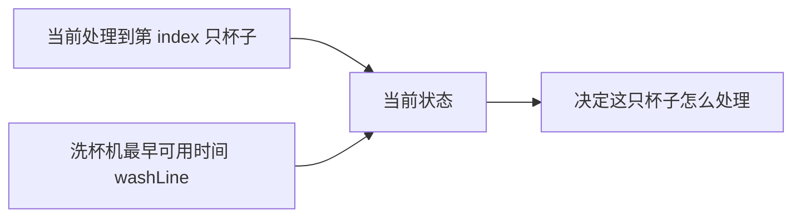
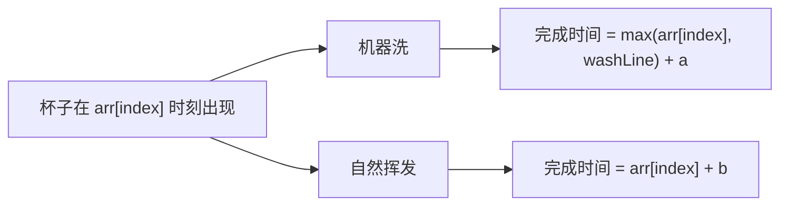
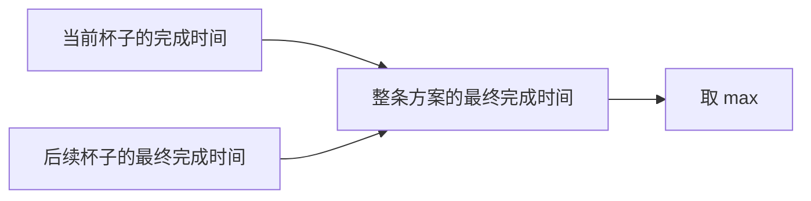

# 15-尝试模型4-寻找业务限制-咖啡杯清洗问题
[返回章节](README.md) | [返回分类](../../README.md) | [返回总目录](../../README.md)

- 状态：已标记完成
- 所属分类：基础巩固
- 所属章节：13 暴力递归到动态规划2-尝试模型
- 原始条目：寻找业务限制-咖啡杯清洗问题

## 题目
给定一个数组 `arr`，其中 `arr[i]` 表示第 `i` 个人喝完咖啡、把杯子放到待处理区的时间。

现在每只杯子变干净有两种方式：

- 用洗杯机洗：一次只能洗一只，洗一只需要 `a` 时间
- 自然挥发：每只杯子都可以自己挥发干净，耗时 `b`，彼此互不影响

问：怎样安排每只杯子是“机器洗”还是“自然挥发”，才能让所有杯子都变干净的时间尽量早。

输入：
- `int[] arr`
- `int a`
- `int b`

输出：
- 一个整数，表示所有杯子都干净的最早时间

## 一句话结论
这题最关键的不是“现在处理第几个杯子”，而是“洗杯机下一次最早什么时候能用”。

所以递归状态不能只写 `index`，还必须把真正卡住后续决策的业务限制 `washLine` 一起带上。

## 理论 / 应用价值
- 这是“寻找业务限制”模型里非常典型的一题。
- 难点不在分支本身，而在于先识别出真正影响后续决策的那个量。
- 很多业务题、调度题、资源占用题，表面上看是在枚举对象，实际上真正决定后续的是“资源何时释放”。

## 核心知识点
- 每只杯子都有两种选择：机器洗，或者自然挥发。
- 当前状态不能只看 `index`，因为同样处理第 `index` 只杯子，洗杯机空闲时间不同，答案就可能完全不同。
- 一条方案内部，最终完成时间取决于“最慢完成的那只杯子”，所以要取 `max`。
- 两条方案之间，我们要挑更优的那条，所以最后取 `min`。

## 图解
### 这题真正影响后续的是什么


同样都是处理第 `index` 只杯子：

- 如果洗杯机现在空着
- 和洗杯机还要等很久才空出来

这两个状态的最优答案通常不一样。

### 当前杯子的两种选择


### 为什么一条方案里要取 `max`


因为我们求的不是“每只杯子各花了多少时间的总和”，而是：

```text
所有杯子里，最后一个变干净的时刻
```

谁更晚，整条方案就得等谁。

## 解题思路
### 1. 先找到真正的业务限制
这题最容易想偏的地方，是把它看成“每只杯子各自独立做选择”。

但其实不行，因为：
- 自然挥发不占用公共资源
- 机器洗会占用唯一的一台洗杯机

所以当前杯子如果选了机器洗，就会直接改写后面杯子的排队起点。

这就是为什么这题的关键状态不是“杯子编号”，而是：

```text
洗杯机最早什么时候能再次使用
```

### 2. 定义递归状态
定义：
```text
process(index, washLine)
```

表示：
- 从第 `index` 只杯子开始处理
- 当前洗杯机最早可用时间是 `washLine`
- 返回后续所有杯子都变干净的最早完成时间

### 3. 先彻底理解 `max` 和 `min`
这一题最容易卡住的地方，就是下面这两句：

- 一条方案内部，要取 `max`
- 两条方案之间，要取 `min`

别急着背，先看它们分别在回答什么问题。

#### 先看“为什么方案内部要取 `max`”
假设当前杯子选了机器洗，它会在时间 `wash` 变干净。  
与此同时，后面的杯子也会继续递归求出一个“全部处理完的时间”。

那么这一整条方案什么时候才算真正结束？

不是当前杯子洗完就结束，也不是后面结束就算结束，而是：

```text
当前杯子和后续杯子，谁更晚结束，就要等谁
```

所以方案内部要写成：

```text
max(当前杯子的完成时间, 后续杯子的完成时间)
```

换句话说，`max` 的意思不是“选更大的更好”，而是：

```text
整条方案的完工时间，天然就是那个更晚的时刻
```

#### 再看“为什么两条方案之间要取 `min`”
当前杯子有两种处理方式：

1. 机器洗
2. 自然挥发

这两种方式都会各自产生一条完整方案，也都会算出“全部杯子最终结束的时间”。

这时我们真正要的，是更优的那条方案，也就是：

```text
哪一条能让所有杯子更早全部干净
```

所以最后才在两条方案之间取：

```text
min(机器洗方案, 自然挥发方案)
```

#### 用一句话压缩这件事
```text
方案内部取 max：因为要等最慢的那个结束
方案之间取 min：因为要挑更优的那条方案
```

## 典型例子
```text
arr = [1, 3]
a = 2
b = 5
```

初始状态是：
```text
process(0, 0)
```

表示：
- 从第 0 只杯子开始处理
- 洗杯机一开始空闲

### 第 0 只杯子选机器洗
```text
wash = max(1, 0) + 2 = 3
```

说明第 0 只杯子会在时间 `3` 洗完。  
后续状态变成：

```text
process(1, 3)
```

假设递归算出来：

```text
process(1, 3) = 5
```

那这条“第 0 只杯子选机器洗”的完整方案，最终结束时间就是：

```text
max(3, 5) = 5
```

意思是：
- 当前杯子在 3 时刻已经干净
- 但后面那只杯子要到 5 时刻才全部结束
- 所以整条方案只能算 5 时刻结束

### 第 0 只杯子选自然挥发
```text
dry = 1 + 5 = 6
```

因为没占用洗杯机，后续状态还是：

```text
process(1, 0)
```

假设递归算出来：

```text
process(1, 0) = 5
```

那这条“第 0 只杯子选自然挥发”的完整方案，最终结束时间就是：

```text
max(6, 5) = 6
```

这里虽然后面的杯子 5 时刻就结束了，但第 0 只杯子要等到 6 时刻自然挥发完，所以整条方案必须等到 6。

### 最后为什么再取 `min`
现在两条完整方案分别得到：

```text
机器洗方案：5
自然挥发方案：6
```

我们当然选更早结束的那条：

```text
min(5, 6) = 5
```

这就是这题里：

- 方案内部取 `max`
- 方案之间取 `min`

最直观的含义。

## 代码 / 伪代码
```java
int process(int[] arr, int a, int b, int index, int washLine) {
    if (index == arr.length - 1) {
        int wash = Math.max(arr[index], washLine) + a;
        int dry = arr[index] + b;
        return Math.min(wash, dry);
    }

    int wash = Math.max(arr[index], washLine) + a;
    int next1 = process(arr, a, b, index + 1, wash);
    int p1 = Math.max(wash, next1);

    int dry = arr[index] + b;
    int next2 = process(arr, a, b, index + 1, washLine);
    int p2 = Math.max(dry, next2);

    return Math.min(p1, p2);
}
```

## 代码思路说明
第一次看这段代码时，可以不要一下子盯所有变量，按下面顺序读：

### 第一步：先看函数在求什么
```java
process(arr, a, b, index, washLine)
```

它不是在求“当前杯子怎么处理”，而是在求：

```text
从第 index 只杯子开始，
当洗杯机最早可用时间是 washLine 时，
后面所有杯子最早什么时候能全部变干净
```

所以这个函数返回的是“一个完整子问题的最优结束时间”。

### 第二步：先看 base case
```java
if (index == arr.length - 1) {
    int wash = Math.max(arr[index], washLine) + a;
    int dry = arr[index] + b;
    return Math.min(wash, dry);
}
```

如果只剩最后一只杯子，事情就很简单了：

- 要么机器洗
- 要么自然挥发

没有后续杯子要考虑，所以直接比较这两种结束时间，取更小的即可。

这里的 `wash` 不是“开始洗的时间”，而是：

```text
最后一只杯子机器洗完的时间
```

### 第三步：一般情况永远只做两件事
对于当前杯子，只尝试两条路：

#### 路 1：当前杯子机器洗
```java
int wash = Math.max(arr[index], washLine) + a;
int next1 = process(arr, a, b, index + 1, wash);
int p1 = Math.max(wash, next1);
```

可以拆成三层理解：

1. 先算当前杯子什么时候洗完  
   `wash`

2. 再递归去算“后面的杯子，在洗杯机下次可用时间变成 `wash` 后，最早什么时候全部结束”  
   `next1`

3. 把这两部分拼成一条完整方案  
   `p1 = max(wash, next1)`

这里的 `p1`，就代表：

```text
当前杯子选机器洗时，
整条方案最终结束的时间
```

#### 路 2：当前杯子自然挥发
```java
int dry = arr[index] + b;
int next2 = process(arr, a, b, index + 1, washLine);
int p2 = Math.max(dry, next2);
```

同样拆成三层：

1. 先算当前杯子什么时候自然挥发完  
   `dry`

2. 再递归去算后面的杯子最早什么时候全部结束  
   注意这里后续状态还是 `washLine`，因为自然挥发不会占用洗杯机

3. 拼成这一条完整方案  
   `p2 = max(dry, next2)`

### 第四步：最后才在两条方案之间选更优
```java
return Math.min(p1, p2);
```

到这一步，`p1` 和 `p2` 都已经是“完整方案”的结束时间了。  
所以这里只是在问：

```text
机器洗这条路更早结束？
还是自然挥发这条路更早结束？
```

于是取 `min`。

### 用一句流程话串起来
你可以把整段代码理解成：

```text
先决定当前杯子怎么处理
-> 再递归求后面的最优结束时间
-> 先在每条方案内部取 max
-> 最后在两条方案之间取 min
```

## 易错点
- 求的是“所有杯子都干净的最早时刻”，不是所有时间简单相加。
- `washLine` 不是当前杯子的出现时间，而是洗杯机最早可用时间。
- 机器洗的开始时刻要写成 `max(arr[index], washLine)`。
- `max` 表示“一条方案要等最慢的那个结束”，不是“随便取大值”。
- `min` 表示“两条完整方案之间挑更优的那条”。

## 记忆点
- 这题的核心状态不是杯子编号，而是 `index + washLine`。
- 方案内部取 `max`，因为要等最慢的那个结束。
- 方案之间取 `min`，因为要选更优的那条方案。
- 机器洗会改写后续状态，自然挥发不会。
- 递归到动态规划的演进，见下一篇：[16-改动态规划-咖啡杯清洗问题](../14-暴力递归到动态规划3-暴力递归改动态规划/16-改动态规划-咖啡杯清洗问题.md)
