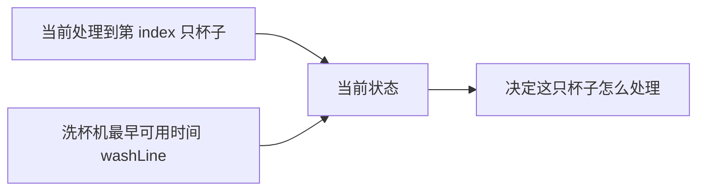
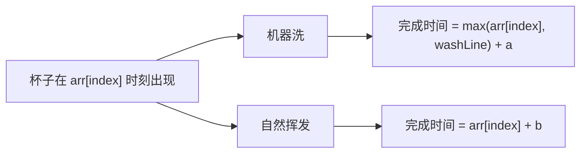
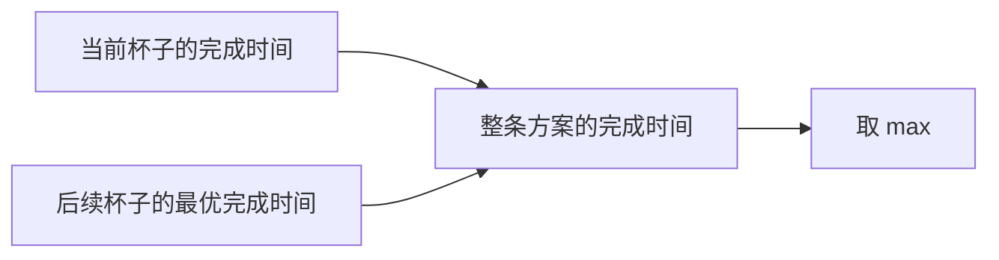

# 15-尝试模型4-寻找业务限制-咖啡杯清洗问题

[返回章节](README.md) | [返回分类](../../README.md) | [返回总目录](../../README.md)

- 状态：已标记完成
- 所属分类：基础巩固
- 所属章节：13 暴力递归到动态规划2-尝试模型
- 原始条目：寻找业务限制-咖啡杯清洗问题

## 题目
给定一个数组 `arr`，其中 `arr[i]` 表示第 `i` 个人喝完咖啡、把杯子放到待处理区的时间。

现在每只杯子变干净有两种方式：

- 用洗杯机洗：一次只能洗一只，洗一只需要 `a` 时间
- 自然挥发：每只杯子都可以自己挥发干净，耗时 `b`，彼此互不影响

问：怎样安排每只杯子是“机器洗”还是“自然挥发”，才能让所有杯子都变干净的时间尽量早。

输入：

- `int[] arr`
- `int a`
- `int b`

输出：

- 一个整数，表示所有杯子都干净的最早时间

## 一句话结论
这题最关键的不是“现在处理第几个杯子”，而是“洗杯机下一次最早什么时候能用”。

所以它的递归状态不能只写 `index`，还必须把真正卡住后续决策的业务限制 `washLine` 一起带上。

## 理论 / 应用价值
- 这是“寻找业务限制”模型里非常典型的一题。
- 难点不在分支本身，而在于先识别出真正影响后续决策的那个量。
- 很多业务题、调度题、资源占用题，表面上看是在枚举对象，实际上真正决定后续的是“资源何时释放”。

## 核心知识点
- 每只杯子都有两种选择：机器洗，或者自然挥发。
- 当前状态不能只看 `index`，因为同样处理第 `index` 只杯子，洗杯机空闲时间不同，答案就可能完全不同。
- 一条方案内部，当前杯子的完成时间和后续杯子的完成时间要取 `max`。
- 两条方案之间，最后再取 `min`。

## 图解
### 这题真正影响后续的是什么


同样都是处理第 `index` 只杯子：

- 如果洗杯机现在空着
- 和洗杯机还要等很久才空出来

这两个状态的最优答案通常不一样。

### 当前杯子的两种选择


### 为什么一条方案里要取 `max`


因为我们求的不是“总耗时之和”，而是“最后一只杯子彻底干净的时刻”。

## 解题思路
### 1. 先找到真正的业务限制
这题最容易想偏的地方，是把它看成“每只杯子各自独立做选择”。

但其实不行，因为：

- 自然挥发不占用公共资源
- 机器洗会占用唯一的一台洗杯机

所以当前杯子如果选了机器洗，就会直接改写后面杯子的排队起点。

这就是为什么这题的关键状态不是“杯子编号”，而是：

```text
洗杯机最早什么时候能再次使用
```

### 2. 定义递归状态
定义：

```text
process(index, washLine)
```

表示：

- 从第 `index` 只杯子开始处理
- 当前洗杯机最早可用时间是 `washLine`
- 返回后续所有杯子都变干净的最早完成时间

### 3. base case
如果已经来到最后一只杯子，那么它只剩两种选择：

1. 机器洗

```text
wash = max(arr[index], washLine) + a
```

2. 自然挥发

```text
dry = arr[index] + b
```

最后直接取较小值：

```text
min(wash, dry)
```

### 4. 一般情况
当前杯子同样有两种选择。

#### 选择 1：机器洗
先算这只杯子什么时候洗完：

```text
wash = max(arr[index], washLine) + a
```

这里为什么要取 `max`：

- 杯子得先出现
- 洗杯机也得先空出来

所以真正开始洗的时刻，是这两者里更晚的那个。

接着，后续状态会变成：

```text
process(index + 1, wash)
```

整条“机器洗”方案的最终完成时间是：

```text
max(wash, process(index + 1, wash))
```

#### 选择 2：自然挥发
这只杯子的完成时间：

```text
dry = arr[index] + b
```

因为它不占用洗杯机，所以后续状态仍然是：

```text
process(index + 1, washLine)
```

整条“自然挥发”方案的最终完成时间是：

```text
max(dry, process(index + 1, washLine))
```

#### 当前状态答案
最后在两条方案里取更优的：

```text
min(p1, p2)
```

## 典型例子
```text
arr = [1, 3]
a = 2
b = 5
```

初始状态是：

```text
process(0, 0)
```

表示：

- 从第 0 只杯子开始处理
- 洗杯机一开始空闲

### 第 0 只杯子选机器洗
```text
wash = max(1, 0) + 2 = 3
```

说明第 0 只杯子会在时间 `3` 洗完。  
后续状态变成：

```text
process(1, 3)
```

### 第 0 只杯子选自然挥发
```text
dry = 1 + 5 = 6
```

因为没占用洗杯机，后续状态还是：

```text
process(1, 0)
```

这时就能很直观地看到 `washLine` 的作用：

- `process(1, 3)` 和 `process(1, 0)`
- 虽然都是处理第 1 只杯子
- 但洗杯机的可用时刻不同，后续最优答案就可能不同

所以这题绝不能只写成 `process(index)`。

## 代码 / 伪代码
```java
int process(int[] arr, int a, int b, int index, int washLine) {
    if (index == arr.length - 1) {
        int wash = Math.max(arr[index], washLine) + a;
        int dry = arr[index] + b;
        return Math.min(wash, dry);
    }

    int wash = Math.max(arr[index], washLine) + a;
    int next1 = process(arr, a, b, index + 1, wash);
    int p1 = Math.max(wash, next1);

    int dry = arr[index] + b;
    int next2 = process(arr, a, b, index + 1, washLine);
    int p2 = Math.max(dry, next2);

    return Math.min(p1, p2);
}
```

第一次读这段代码时，只要先抓住下面这条主线就够了：

```text
每只杯子有两种处理方式
每种方式内部先和后续答案取 max
两种方式之间最后取 min
```

## 易错点
- 求的是“所有杯子都干净的最早时刻”，不是所有时间简单相加。
- `washLine` 不是当前杯子的出现时间，而是洗杯机最早可用时间。
- 机器洗的开始时刻要写成 `max(arr[index], washLine)`。
- 难点不是分支多，而是先识别出真正的业务限制。

## 记忆点
- 这题的核心状态不是杯子编号，而是 `index + washLine`。
- 一条方案内部取 `max`，两条方案之间取 `min`。
- 机器洗会改写后续状态，自然挥发不会。
- 递归到动态规划的演进，见下一篇：[17-改动态规划-咖啡杯清洗问题](../14-暴力递归到动态规划3-暴力递归改动态规划/17-改动态规划-咖啡杯清洗问题.md)
