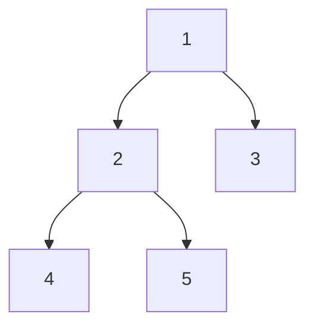

# LeetCode 题目讲解模板

> 适用场景：
>
> - 整理单道 LeetCode 题的学习笔记
> - 输出面试讲解稿
> - 生成 Jupyter Notebook 的讲解结构
> - 从“会做题”升级到“会讲题、会应用、会扩展”

> 输出格式要求：
>
> - 默认输出为 `Jupyter Notebook`，即 `.ipynb` 文件
> - 不要只输出一份纯 Markdown 文档
> - 讲解内容放在 `Markdown cell`
> - 代码、demo、调试输出放在 `Code cell`
> - 如果需要图解，优先使用 notebook 中可直接展示的形式，例如纯文本图、Markdown 表格、Mermaid、逐步打印状态
> - 最终成品应当能直接在 Jupyter Notebook 中阅读、运行和继续补充

---

## 1. 基本信息

- 题号：
- 题目英文名：
- 题目中文名：
- 题目链接：
- 题型：
- 难度：
- 推荐优先级：

建议在 notebook 中把这一部分放在开头的 `Markdown cell`。

---

## 2. 题目一句话总结

用 1 到 2 句话说明这道题到底在解决什么问题。

示例：

> 这道题要求我们在满足约束条件的前提下，找到一个最优结果。  
> 本质上是在考察 `________` 这种算法思想。

---

## 3. 题目理解

### 3.1 题目要求

用自己的话重新描述题意，不要直接照抄题面。

### 3.2 输入与输出

- 输入：
- 输出：
- 返回结果含义：

### 3.3 关键约束

- 数据范围：
- 是否要求原地修改：
- 是否要求特定复杂度：
- 是否有特殊边界：

### 3.4 示例分析

挑一个示例，手动走一遍。

---

## 4. 朴素思路

### 4.1 最直接的做法

先写最容易想到的暴力解法。

### 4.2 为什么不够好

- 时间复杂度太高？
- 空间复杂度太高？
- 重复计算太多？
- 不满足题目要求？

### 4.3 从暴力到优化的关键观察

写出你是如何发现优化方向的。

示例：

- 我们其实不需要重复遍历已经处理过的数据
- 当前状态可以由前一个状态推出来
- 局部最优可以帮助得到全局最优
- 数据本身有单调性，可以用二分
- 可以用额外空间换查询速度

---

## 5. 核心算法思路

### 5.1 算法名称

这道题的核心算法是：

- `双指针`
- `滑动窗口`
- `二分查找`
- `动态规划`
- `DFS / BFS`
- `回溯`
- `单调栈`
- `单调队列`
- `前缀和`
- `并查集`
- `Trie`
- `KMP`
- `堆`
- `贪心`
- `分治`
- 其他：`________`

### 5.2 为什么想到这个算法

说明这道题为什么适合这个算法，而不是只给结论。

### 5.3 关键状态 / 数据结构

- 状态定义：
- 指针含义：
- 数组含义：
- 哈希表含义：
- 栈 / 队列里存什么：
- 递归函数参数含义：

### 5.4 步骤拆解

把算法拆成 3 到 6 个步骤。

示例：

1. 初始化
2. 遍历 / 递归 / 入堆
3. 更新状态
4. 维护不变量
5. 得到答案

---

## 6. 关键图解 / 过程演示

这一节建议手动画或者用文字模拟。

在 notebook 中，这一节优先写成单独的 `Markdown cell`，必要时再配合 `Code cell` 做状态打印演示。

可以写：

- 指针怎么移动
- 窗口怎么扩张和收缩
- 栈 / 队列状态如何变化
- DP 表怎么填写
- 递归树如何展开

示例：

```text
初始状态：
left = 0, right = 0
window = {}

步骤 1：
...

步骤 2：
...
```

### 6.1 推荐补充的图解类型

根据题型不同，可以选不同的图：

- 数组 / 双指针题：
  - 指针移动图
  - 窗口扩张与收缩图
  - 下标变化示意图
- 链表题：
  - 节点连接关系图
  - 指针移动图
  - 反转前后对比图
- 二叉树题：
  - 树结构图
  - DFS / BFS 遍历顺序图
  - 递归返回值示意图
- 动态规划题：
  - DP 表格图
  - 状态转移箭头图
  - 递推顺序图
- 图论题：
  - 邻接关系图
  - BFS / DFS 扩展图
  - 并查集合并过程图
- 栈 / 队列题：
  - 入栈出栈过程图
  - 单调栈变化图
  - 单调队列窗口图
- KMP / Trie / 字符串题：
  - `next` 数组图
  - 前后缀匹配图
  - Trie 树结构图

### 6.2 图解要表达什么

图解不是为了“好看”，而是为了帮助理解关键机制。

建议每张图至少回答一个问题：

- 指针为什么这样移动？
- 为什么当前状态可以转移到下一个状态？
- 为什么这个数据结构里要存这些内容？
- 为什么这个位置可以剪枝？
- 为什么这个答案会被更新？

### 6.3 图解模板

你可以直接套这个小模板：

#### 图解目标

这张图想解释什么？

#### 初始状态

当前有哪些变量、节点、状态？

#### 变化过程

每一步发生了什么？

#### 最终结论

通过这张图能看懂什么？

### 6.4 建议优先画图的题型

下面这些题，强烈建议补图：

- 链表指针题
- 树的递归题
- 动态规划题
- 单调栈 / 单调队列题
- 回溯题
- KMP / Trie 题

### 6.5 可选图解表现形式

可以根据你的整理方式选一种：

- 纯文本图
- Markdown 表格
- Mermaid 流程图 / 结构图
- notebook 中逐步打印状态
- 图片草图

### 6.6 Mermaid 图解示例

如果你后面想在 Markdown 或 notebook 中加入结构图，可以用 Mermaid。

示例：链表反转


示例：二叉树结构



### 6.7 图解后的讲解句式

图解后建议补一句总结：

> 从图里可以看到，算法真正的关键不是 `________`，而是 `________`。

或者：

> 如果不画这张图，最容易误解的地方是 `________`。

---

## 7. Python 题解

这一节在 notebook 中建议拆成两个部分：

- 一个 `Markdown cell` 说明思路
- 一个或多个 `Code cell` 放可运行代码

### 7.1 标准版本

```python
class Solution:
    def xxx(self, ...):
        pass
```

### 7.2 带详细注释版本

```python
class Solution:
    def xxx(self, ...):
        # 这里初始化什么，为什么
        pass
```

---

## 8. 代码逐段讲解

按代码块解释，不要逐行机械翻译。

### 8.1 初始化部分

解释为什么这样初始化。

### 8.2 主循环 / 主递归

解释核心逻辑。

### 8.3 更新答案

解释什么时候更新答案，为什么。

### 8.4 返回结果

解释返回值含义。

---

## 9. 复杂度分析

- 时间复杂度：
- 为什么是这个时间复杂度：
- 空间复杂度：
- 为什么是这个空间复杂度：

---

## 10. 易错点

这一节非常重要，建议每题至少写 3 条。

示例：

- 边界条件没有处理空数组 / 空链表
- 忘了更新答案
- 循环条件写错导致漏掉最后一次
- 去重逻辑不完整
- 递归出口不对
- 原地修改时破坏了原有结构

---

## 11. 面试时怎么讲

这一节专门用于口头表达。

可以按这个顺序：

1. 我先说一下题意
2. 最直接的做法是什么
3. 为什么要优化
4. 我采用什么算法
5. 核心状态是什么
6. 时间和空间复杂度是多少

示例话术：

> 这题我会用 `________` 来做。  
> 原因是题目里有 `________` 这个特征，所以可以把复杂度从 `________` 优化到 `________`。  
> 实现上我会维护 `________`，遍历过程中不断更新 `________`。

---

## 12. 实际应用场景

这一节是 AI 时代特别值得补的。

### 12.1 这道题在现实中对应什么问题

例如：

- 滑动窗口最大值 -> 监控系统中最近 N 秒最大流量
- 前缀和 -> 区间统计、日志累计值查询
- Trie -> 搜索提示、词典补全
- LRU -> 缓存淘汰
- BFS -> 最短路径、最少步数问题
- 并查集 -> 网络连通性、账号合并

### 12.2 在哪些开源项目或技术中有类似思想

可以写：

- Redis
- Elasticsearch
- Kafka
- Nginx
- 数据库索引
- 编译器
- 搜索引擎
- 操作系统调度
- 图计算系统

### 12.3 这道题解决了什么实际问题

一句话概括即可。

---

## 13. 小 Demo 演示

建议一定补一个最小可运行 demo。

这一节在 notebook 中应当使用 `Code cell`，这样可以直接运行并展示输出。

### 13.1 Demo 目标

说明你要模拟什么现实场景。

### 13.2 Demo 代码

```python
def demo():
    pass

demo()
```

### 13.3 Demo 输出说明

解释输出结果代表什么。

---

## 14. 扩展题 / 变形题

列出这道题相关的变形题，用来形成题组。

示例：

- 基础题：
- 进阶题：
- 同类型题：
- 面试常一起问的题：

---

## 15. 一句话复盘

最后用一句话总结这题最重要的收获。

示例：

> 这题的关键不是写代码，而是识别出它本质上是一个 `________` 问题。

---

## 16. 个人补充记录

这一节留给自己后续补充。

- 我第一次做错的点：
- 我现在的理解：
- 以后复习时重点看：
- 是否值得背模板：
- 是否值得补小专题：

---

## 17. 可复用最简版模板

如果你后面想快速整理一道题，可以只保留这 7 项：

```md
# 题号 + 题名

## 题目一句话总结

## 朴素思路

## 核心算法思路

## Python 题解

## 复杂度分析

## 易错点

## 实际应用场景
```

---

## 18. 推荐使用方式

你后面整理 notebook 时，推荐每道题至少保留这些内容：

1. 题目一句话总结
2. 核心算法思路
3. 带注释 Python 代码
4. 易错点
5. 实际应用场景
6. 一个小 demo

这样整理出来的内容，才更适合 AI 时代长期复习，而不是只适合“当场刷过一次题”。

补充一点：

- 这份模板的目标产物默认是 `Jupyter Notebook (.ipynb)`
- 如果用它生成题解，应该按 notebook 的 cell 结构组织内容，而不是把所有内容塞进单个 Markdown 文件
- 推荐顺序是：标题与摘要 `Markdown cell` -> 思路讲解 `Markdown cell` -> 题解代码 `Code cell` -> 图解 `Markdown cell` -> demo `Code cell`
